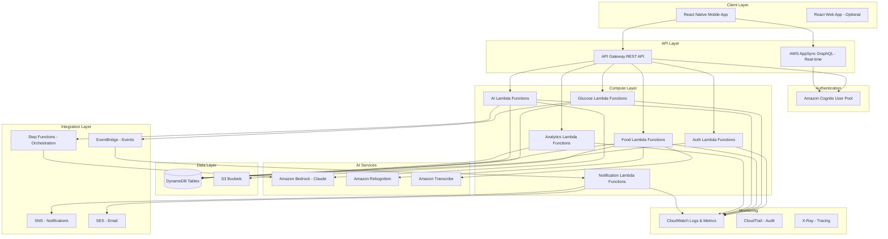
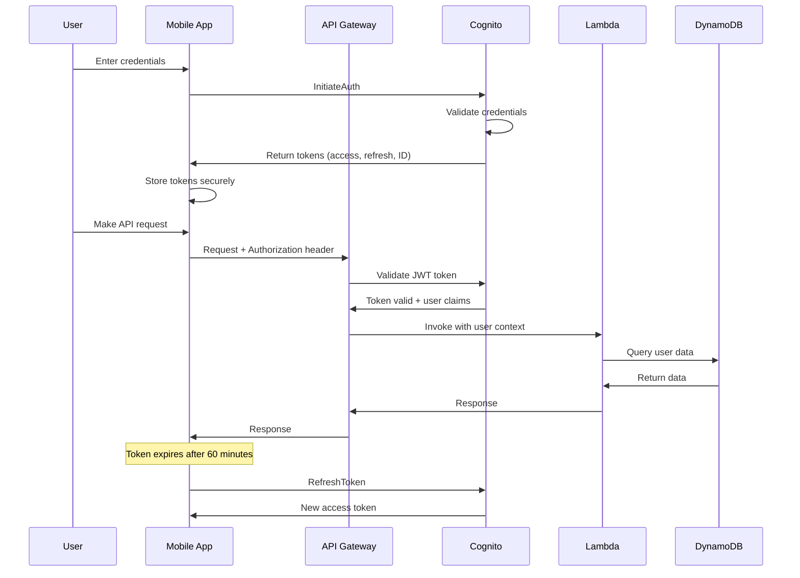

# Design Document: AI Diet & Meal Recommendation System

## Overview

The AI Diet & Meal Recommendation System is a production-ready, HIPAA-compliant diabetes management platform built on AWS serverless architecture. The system provides intelligent glucose monitoring, AI-powered food recognition, predictive analytics, and personalized meal recommendations for pre-diabetes, Type 1, and Type 2 diabetes patients.

### Design Philosophy

**"Build frontend neatly, build backend correctly and slow"** - This design emphasizes:
- **Frontend**: Clean, intuitive mobile-first React Native UI with excellent UX
- **Backend**: Robust, secure, scalable AWS serverless architecture with proper error handling, monitoring, and cost optimization
- **Quality over Speed**: Production-ready patterns, comprehensive testing, and maintainable code

### Key Design Principles

1. **Serverless-First**: Leverage AWS managed services to minimize operational overhead
2. **Security by Default**: HIPAA compliance, encryption at rest/transit, least-privilege access
3. **Cost-Optimized**: Freemium model with usage tracking, on-demand scaling, lifecycle policies
4. **AI-Powered**: Amazon Bedrock (Claude) for predictions, Rekognition for images, Transcribe for voice
5. **Mobile-First**: React Native for iOS/Android with offline-first capabilities
6. **Observable**: Comprehensive logging, monitoring, and alerting with CloudWatch
7. **Testable**: Property-based testing for parsers, unit tests for business logic, integration tests for AWS services

## Architecture

### High-Level Architecture




### Architecture Layers

#### 1. Client Layer
- **React Native Mobile App**: Primary interface for iOS and Android
- **React Web App**: Optional web interface for healthcare providers and desktop users
- **Offline-First**: Local storage with sync when online
- **State Management**: Redux Toolkit for predictable state management

#### 2. API Layer
- **API Gateway REST API**: Synchronous request/response for CRUD operations
- **AWS AppSync GraphQL**: Real-time subscriptions for glucose updates and notifications
- **Rate Limiting**: 100 requests/minute per user (Requirement 13.6)
- **Request Validation**: JSON Schema validation at API Gateway level

#### 3. Authentication & Authorization
- **Amazon Cognito User Pool**: User registration, login, MFA support
- **JWT Tokens**: Stateless authentication with 60-minute expiry (Requirement 13.5)
- **Custom Authorizers**: Lambda authorizers for fine-grained access control
- **Role-Based Access**: User, Premium User, Healthcare Provider roles

#### 4. Compute Layer (Lambda Functions)
- **Auth Functions**: Registration, login, profile management
- **Glucose Functions**: CRUD for glucose readings, CGM sync
- **Food Functions**: Image upload, food recognition, nutrient analysis
- **AI Functions**: Predictions, recommendations, pattern insights
- **Analytics Functions**: Dashboard metrics, report generation
- **Notification Functions**: Alerts, reminders, weekly summaries

#### 5. AI Services Integration
- **Amazon Bedrock (Claude 3)**: 
  - Glucose predictions
  - Meal recommendations
  - Pattern insights
  - Insulin dose calculations
  - Natural language food parsing
- **Amazon Rekognition**: Food image recognition
- **Amazon Transcribe**: Voice-to-text for data entry

#### 6. Data Layer
- **DynamoDB Tables**: User profiles, glucose readings, food logs, usage tracking
- **S3 Buckets**: Food images, generated reports, backups
- **Encryption**: KMS encryption at rest, TLS 1.2+ in transit (Requirement 13.1, 13.2)

#### 7. Integration & Orchestration
- **Step Functions**: Multi-step AI workflows (e.g., image → recognition → nutrient analysis)
- **EventBridge**: Event-driven architecture for glucose alerts, pattern analysis triggers
- **SNS**: Push notifications, SMS alerts
- **SES**: Email notifications, weekly reports

#### 8. Monitoring & Observability
- **CloudWatch Logs**: Centralized logging for all Lambda functions
- **CloudWatch Metrics**: Custom metrics for usage tracking, AI request counts
- **CloudWatch Alarms**: Alerts for errors, latency, cost thresholds
- **CloudTrail**: Audit logging for HIPAA compliance (Requirement 13.3)
- **X-Ray**: Distributed tracing for performance optimization

## Components and Interfaces

### Frontend Components (React Native)

#### Core Components


```
src/
├── components/
│   ├── auth/
│   │   ├── LoginScreen.tsx
│   │   ├── RegisterScreen.tsx
│   │   └── ProfileScreen.tsx
│   ├── glucose/
│   │   ├── GlucoseEntryForm.tsx
│   │   ├── GlucoseHistoryList.tsx
│   │   └── CGMSyncButton.tsx
│   ├── dashboard/
│   │   ├── DashboardScreen.tsx
│   │   ├── eA1CCard.tsx
│   │   ├── TIRCard.tsx
│   │   ├── AGPChart.tsx
│   │   └── GlucoseTrendChart.tsx
│   ├── food/
│   │   ├── FoodCameraScreen.tsx
│   │   ├── FoodTextEntry.tsx
│   │   ├── VoiceEntryButton.tsx
│   │   └── NutrientDisplay.tsx
│   ├── ai/
│   │   ├── GlucosePredictionChart.tsx
│   │   ├── MealRecommendationCard.tsx
│   │   ├── PatternInsightCard.tsx
│   │   └── InsulinDoseCalculator.tsx
│   ├── activity/
│   │   ├── ActivityLogForm.tsx
│   │   └── ActivityHistoryList.tsx
│   ├── provider/
│   │   ├── ProviderInviteScreen.tsx
│   │   └── ProviderAccessList.tsx
│   ├── subscription/
│   │   ├── UsageLimitDisplay.tsx
│   │   ├── UpgradePrompt.tsx
│   │   └── PaymentScreen.tsx
│   └── shared/
│       ├── LoadingSpinner.tsx
│       ├── ErrorBoundary.tsx
│       └── OfflineIndicator.tsx
├── services/
│   ├── api/
│   │   ├── authApi.ts
│   │   ├── glucoseApi.ts
│   │   ├── foodApi.ts
│   │   ├── aiApi.ts
│   │   └── analyticsApi.ts
│   ├── storage/
│   │   ├── secureStorage.ts
│   │   └── offlineQueue.ts
│   └── integrations/
│       ├── cgmIntegration.ts
│       └── fitnessTrackerIntegration.ts
├── store/
│   ├── slices/
│   │   ├── authSlice.ts
│   │   ├── glucoseSlice.ts
│   │   ├── foodSlice.ts
│   │   └── usageSlice.ts
│   └── store.ts
├── utils/
│   ├── validation.ts
│   ├── formatting.ts
│   └── calculations.ts
└── App.tsx
```

#### Key Frontend Patterns

**1. Offline-First Architecture**
- Local SQLite database for offline data storage
- Background sync queue for pending API requests
- Optimistic UI updates with rollback on failure

**2. State Management**
- Redux Toolkit for global state (user, glucose data, usage limits)
- React Query for server state caching and synchronization
- Local component state for UI-only concerns

**3. Error Handling**
- Error boundaries for graceful failure recovery
- User-friendly error messages with retry options
- Automatic error reporting to CloudWatch

**4. Accessibility**
- WCAG 2.1 Level AA compliance (Requirement: Non-Functional)
- Screen reader support for all interactive elements
- High contrast mode for better visibility
- Keyboard navigation support

### Backend Components (AWS Lambda)

#### Lambda Function Organization


```
lambda/
├── auth/
│   ├── register/
│   │   ├── handler.ts
│   │   ├── validator.ts
│   │   └── tests/
│   ├── login/
│   │   ├── handler.ts
│   │   └── tests/
│   └── profile/
│       ├── getProfile.ts
│       ├── updateProfile.ts
│       └── tests/
├── glucose/
│   ├── createReading/
│   │   ├── handler.ts
│   │   ├── validator.ts
│   │   └── tests/
│   ├── getReadings/
│   │   ├── handler.ts
│   │   └── tests/
│   ├── cgmSync/
│   │   ├── handler.ts
│   │   ├── dexcomAdapter.ts
│   │   ├── libreAdapter.ts
│   │   └── tests/
│   ├── bulkUpload/
│   │   ├── uploadFile.ts
│   │   ├── parseFile.ts
│   │   ├── getParseStatus.ts
│   │   ├── importReadings.ts
│   │   ├── parsers/
│   │   │   ├── pdfParser.ts
│   │   │   ├── excelParser.ts
│   │   │   ├── csvParser.ts
│   │   │   └── bedrockExtractor.ts
│   │   ├── validators/
│   │   │   ├── fileValidator.ts
│   │   │   ├── readingValidator.ts
│   │   │   └── duplicateDetector.ts
│   │   └── tests/
│   │       ├── pdfParser.test.ts
│   │       ├── excelParser.test.ts
│   │       ├── csvParser.test.ts
│   │       └── bulkUpload.integration.test.ts
│   └── shared/
│       └── glucoseValidator.ts
├── food/
│   ├── uploadImage/
│   │   ├── handler.ts
│   │   └── tests/
│   ├── recognizeFood/
│   │   ├── handler.ts
│   │   ├── rekognitionService.ts
│   │   └── tests/
│   ├── analyzeNutrients/
│   │   ├── handler.ts
│   │   ├── bedrockService.ts
│   │   └── tests/
│   ├── voiceEntry/
│   │   ├── handler.ts
│   │   ├── transcribeService.ts
│   │   └── tests/
│   └── parser/
│       ├── foodParser.ts
│       ├── foodPrettyPrinter.ts
│       └── tests/
│           └── foodParser.property.test.ts
├── ai/
│   ├── predictGlucose/
│   │   ├── handler.ts
│   │   ├── predictionEngine.ts
│   │   └── tests/
│   ├── recommendMeal/
│   │   ├── handler.ts
│   │   ├── recommendationEngine.ts
│   │   └── tests/
│   ├── analyzePatterns/
│   │   ├── handler.ts
│   │   ├── patternDetector.ts
│   │   └── tests/
│   └── calculateInsulin/
│       ├── handler.ts
│       ├── insulinCalculator.ts
│       └── tests/
├── analytics/
│   ├── calculateMetrics/
│   │   ├── handler.ts
│   │   ├── eA1CCalculator.ts
│   │   ├── tirCalculator.ts
│   │   ├── agpGenerator.ts
│   │   └── tests/
│   └── generateReport/
│       ├── handler.ts
│       ├── pdfGenerator.ts
│       └── tests/
├── notifications/
│   ├── sendAlert/
│   │   ├── handler.ts
│   │   └── tests/
│   ├── sendReminder/
│   │   ├── handler.ts
│   │   └── tests/
│   └── sendWeeklySummary/
│       ├── handler.ts
│       └── tests/
├── provider/
│   ├── inviteProvider/
│   │   ├── handler.ts
│   │   └── tests/
│   └── manageAccess/
│       ├── handler.ts
│       └── tests/
├── subscription/
│   ├── trackUsage/
│   │   ├── handler.ts
│   │   ├── usageTracker.ts
│   │   └── tests/
│   ├── checkLimit/
│   │   ├── handler.ts
│   │   └── tests/
│   └── processPayment/
│       ├── handler.ts
│       └── tests/
└── shared/
    ├── middleware/
    │   ├── authMiddleware.ts
    │   ├── errorHandler.ts
    │   ├── logger.ts
    │   └── usageLimiter.ts
    ├── utils/
    │   ├── dynamoClient.ts
    │   ├── s3Client.ts
    │   ├── bedrockClient.ts
    │   └── validation.ts
    └── types/
        ├── user.ts
        ├── glucose.ts
        ├── food.ts
        └── api.ts
```

#### Lambda Function Patterns

**1. Handler Structure**
```typescript
// Standard Lambda handler pattern
export const handler = async (event: APIGatewayProxyEvent): Promise<APIGatewayProxyResult> => {
  try {
    // 1. Parse and validate input
    const input = parseInput(event);
    await validateInput(input);
    
    // 2. Check authentication and authorization
    const user = await authenticateUser(event);
    await authorizeAction(user, input);
    
    // 3. Check usage limits (for AI features)
    if (isAIFeature) {
      await checkUsageLimit(user, featureName);
    }
    
    // 4. Execute business logic
    const result = await executeBusinessLogic(input, user);
    
    // 5. Track usage (for AI features)
    if (isAIFeature) {
      await trackUsage(user, featureName);
    }
    
    // 6. Return response
    return successResponse(result);
  } catch (error) {
    // Centralized error handling
    return errorResponse(error);
  }
};
```

**2. Middleware Pattern**
```typescript
// Composable middleware for cross-cutting concerns
const withAuth = (handler) => async (event) => {
  const user = await authenticateUser(event);
  return handler(event, user);
};

const withUsageLimit = (featureName) => (handler) => async (event, user) => {
  await checkUsageLimit(user, featureName);
  const result = await handler(event, user);
  await trackUsage(user, featureName);
  return result;
};

const withErrorHandling = (handler) => async (event, ...args) => {
  try {
    return await handler(event, ...args);
  } catch (error) {
    logger.error(error);
    return errorResponse(error);
  }
};

// Compose middleware
export const handler = withErrorHandling(
  withAuth(
    withUsageLimit('food_recognition')(
      async (event, user) => {
        // Business logic here
      }
    )
  )
);
```

**3. Error Handling Strategy**
```typescript
// Custom error types
class ValidationError extends Error {
  statusCode = 400;
}

class UnauthorizedError extends Error {
  statusCode = 401;
}

class UsageLimitError extends Error {
  statusCode = 429;
  remainingDays: number;
}

class AIServiceError extends Error {
  statusCode = 503;
  retryable = true;
}

// Error handler
function errorResponse(error: Error): APIGatewayProxyResult {
  if (error instanceof ValidationError) {
    return {
      statusCode: 400,
      body: JSON.stringify({ error: error.message })
    };
  }
  
  if (error instanceof UsageLimitError) {
    return {
      statusCode: 429,
      body: JSON.stringify({
        error: 'Usage limit exceeded',
        upgradeUrl: '/subscription/upgrade',
        resetDate: calculateResetDate()
      })
    };
  }
  
  // Log unexpected errors
  logger.error('Unexpected error', { error });
  
  return {
    statusCode: 500,
    body: JSON.stringify({ error: 'Internal server error' })
  };
}
```

## Data Models

### DynamoDB Table Design

#### Table 1: Users


**Primary Key**: `user_id` (String, Partition Key)

**Attributes**:
```typescript
interface User {
  user_id: string;                    // Cognito sub
  email: string;
  diabetes_type: 'pre-diabetes' | 'type1' | 'type2';
  age: number;
  weight: number;                     // kg
  height: number;                     // cm
  target_glucose_min: number;         // mg/dL
  target_glucose_max: number;         // mg/dL
  insulin_to_carb_ratio?: number;     // For Type 1 users
  correction_factor?: number;         // For Type 1 users
  dietary_restrictions: string[];     // ['vegetarian', 'gluten-free', etc.]
  subscription_tier: 'free' | 'premium';
  subscription_expiry?: string;       // ISO 8601 date
  notification_preferences: {
    email: boolean;
    sms: boolean;
    push: boolean;
    high_glucose_threshold?: number;
    low_glucose_threshold?: number;
  };
  created_at: string;                 // ISO 8601
  updated_at: string;                 // ISO 8601
}
```

**Access Patterns**:
- Get user by ID: `GetItem(user_id)`
- Update user profile: `UpdateItem(user_id)`

#### Table 2: GlucoseReadings

**Primary Key**: 
- Partition Key: `user_id` (String)
- Sort Key: `timestamp` (String, ISO 8601)

**GSI 1**: `user_id-reading_value-index` for range queries

**Attributes**:
```typescript
interface GlucoseReading {
  user_id: string;
  timestamp: string;                  // ISO 8601, sort key
  reading_value: number;              // mg/dL
  reading_unit: 'mg/dL' | 'mmol/L';
  source: 'manual' | 'cgm_dexcom' | 'cgm_libre';
  notes?: string;
  meal_context?: 'fasting' | 'before_meal' | 'after_meal';
  created_at: string;
}
```

**Access Patterns**:
- Get readings for user in date range: `Query(user_id, timestamp BETWEEN start AND end)`
- Get latest reading: `Query(user_id, ScanIndexForward=false, Limit=1)`
- Calculate eA1C (90 days): `Query(user_id, timestamp > 90_days_ago)`

#### Table 3: FoodLogs

**Primary Key**:
- Partition Key: `user_id` (String)
- Sort Key: `log_id` (String, ULID)

**GSI 1**: `user_id-timestamp-index` for chronological queries

**Attributes**:
```typescript
interface FoodLog {
  user_id: string;
  log_id: string;                     // ULID, sort key
  timestamp: string;                  // ISO 8601
  food_items: FoodItem[];
  total_nutrients: NutrientProfile;
  source: 'image' | 'text' | 'voice';
  image_s3_key?: string;
  raw_input?: string;                 // Original text or transcription
  created_at: string;
}

interface FoodItem {
  name: string;
  portion_size: string;
  preparation_method?: string;
  nutrients: NutrientProfile;
  confidence_score?: number;          // For AI-recognized items
}

interface NutrientProfile {
  carbs_g: number;
  protein_g: number;
  fat_g: number;
  calories: number;
  fiber_g: number;
  sugar_g?: number;
  sodium_mg?: number;
}
```

**Access Patterns**:
- Get food logs for user in date range: `Query(GSI1, user_id, timestamp BETWEEN start AND end)`
- Get specific food log: `GetItem(user_id, log_id)`
- Correlate with glucose: Join with GlucoseReadings by timestamp

#### Table 4: ActivityLogs

**Primary Key**:
- Partition Key: `user_id` (String)
- Sort Key: `timestamp` (String, ISO 8601)

**Attributes**:
```typescript
interface ActivityLog {
  user_id: string;
  timestamp: string;                  // ISO 8601, sort key
  activity_type: 'walking' | 'running' | 'cycling' | 'swimming' | 'strength' | 'other';
  duration_minutes: number;
  intensity: 'low' | 'moderate' | 'high';
  calories_burned?: number;
  source: 'manual' | 'fitbit' | 'apple_health' | 'google_fit';
  notes?: string;
  created_at: string;
}
```

**Access Patterns**:
- Get activities for user in date range: `Query(user_id, timestamp BETWEEN start AND end)`
- Correlate with glucose: Join with GlucoseReadings by timestamp

#### Table 5: UsageTracking

**Primary Key**:
- Partition Key: `user_id` (String)
- Sort Key: `month` (String, format: YYYY-MM)

**Attributes**:
```typescript
interface UsageTracking {
  user_id: string;
  month: string;                      // YYYY-MM, sort key
  food_recognition_count: number;     // Limit: 25/month
  glucose_prediction_count: number;   // Limit: 20/month
  meal_recommendation_count: number;  // Limit: 15/month
  voice_entry_count: number;          // Limit: 20/month
  text_nutrient_analysis_count: number; // Limit: 25/month
  insulin_dose_count: number;         // Limit: 20/month
  pattern_insight_count: number;      // Limit: 1/month
  last_updated: string;               // ISO 8601
}
```

**Access Patterns**:
- Get current month usage: `GetItem(user_id, current_month)`
- Check if limit exceeded: Compare count with tier limits
- Increment usage: `UpdateItem(user_id, month, ADD count 1)`

#### Table 6: AIInsights

**Primary Key**:
- Partition Key: `user_id` (String)
- Sort Key: `insight_id` (String, ULID)

**GSI 1**: `user_id-created_at-index` for chronological queries

**Attributes**:
```typescript
interface AIInsight {
  user_id: string;
  insight_id: string;                 // ULID, sort key
  insight_type: 'pattern' | 'prediction' | 'recommendation';
  title: string;
  description: string;
  supporting_data: {
    glucose_readings?: string[];      // Reading IDs
    food_logs?: string[];             // Log IDs
    activity_logs?: string[];         // Activity timestamps
  };
  actionable_recommendations: string[];
  confidence_score: number;           // 0-1
  created_at: string;                 // ISO 8601
  expires_at?: string;                // For time-sensitive insights
}
```

**Access Patterns**:
- Get recent insights: `Query(GSI1, user_id, created_at > 30_days_ago)`
- Get specific insight: `GetItem(user_id, insight_id)`

#### Table 7: ProviderAccess

**Primary Key**:
- Partition Key: `user_id` (String)
- Sort Key: `provider_email` (String)

**GSI 1**: `provider_email-index` for provider-centric queries

**Attributes**:
```typescript
interface ProviderAccess {
  user_id: string;
  provider_email: string;             // Sort key
  provider_name: string;
  access_granted_at: string;          // ISO 8601
  access_status: 'pending' | 'active' | 'revoked';
  permissions: string[];              // ['read_glucose', 'read_food', 'read_insights']
  last_accessed_at?: string;          // ISO 8601
}
```

**Access Patterns**:
- Get providers for user: `Query(user_id)`
- Get patients for provider: `Query(GSI1, provider_email)`
- Revoke access: `UpdateItem(user_id, provider_email, SET access_status = 'revoked')`

#### Table 8: AuditLogs

**Primary Key**:
- Partition Key: `user_id` (String)
- Sort Key: `timestamp` (String, ISO 8601)

**GSI 1**: `action_type-timestamp-index` for compliance queries

**Attributes**:
```typescript
interface AuditLog {
  user_id: string;
  timestamp: string;                  // ISO 8601, sort key
  action_type: string;                // 'login', 'data_access', 'data_modification', 'provider_access'
  actor_id: string;                   // User or provider ID
  actor_type: 'user' | 'provider' | 'system';
  resource_type: string;              // 'glucose_reading', 'food_log', etc.
  resource_id?: string;
  ip_address: string;
  user_agent: string;
  result: 'success' | 'failure';
  error_message?: string;
}
```

**Access Patterns**:
- Get audit logs for user: `Query(user_id, timestamp BETWEEN start AND end)`
- Compliance reporting: `Query(GSI1, action_type, timestamp > date)`

### DynamoDB Configuration

**Capacity Mode**: On-Demand (auto-scaling for unpredictable workloads)

**Encryption**: AWS KMS encryption at rest (Requirement 13.1)

**Backup**: Point-in-time recovery enabled, daily backups retained for 35 days

**TTL**: Enabled on `expires_at` attribute for AIInsights table

### S3 Bucket Design

#### Bucket 1: food-images-{environment}

**Purpose**: Store user-uploaded food images

**Structure**:
```
s3://food-images-prod/
├── {user_id}/
│   ├── {year}/
│   │   ├── {month}/
│   │   │   ├── {log_id}.jpg
│   │   │   └── {log_id}_thumbnail.jpg
```

**Lifecycle Policy**:
- Transition to S3 Intelligent-Tiering after 30 days
- Delete images older than 2 years (or when user deletes account)

**Security**:
- Private bucket with pre-signed URLs for uploads/downloads
- Server-side encryption with KMS
- CORS configuration for mobile app uploads

#### Bucket 2: reports-{environment}

**Purpose**: Store generated PDF reports

**Structure**:
```
s3://reports-prod/
├── {user_id}/
│   ├── {report_type}/
│   │   ├── {year}-{month}.pdf
```

**Lifecycle Policy**:
- Transition to S3 Glacier after 90 days
- Retain for 7 years (HIPAA compliance)

## API Specifications

### REST API Endpoints (API Gateway)

#### Authentication Endpoints


**POST /auth/register**
```typescript
Request:
{
  email: string;
  password: string;
  diabetes_type: 'pre-diabetes' | 'type1' | 'type2';
  age: number;
  weight: number;
  height: number;
  target_glucose_min: number;
  target_glucose_max: number;
}

Response: 201 Created
{
  user_id: string;
  email: string;
  subscription_tier: 'free';
}
```

**POST /auth/login**
```typescript
Request:
{
  email: string;
  password: string;
}

Response: 200 OK
{
  access_token: string;
  refresh_token: string;
  expires_in: number;
  user: User;
}
```

**GET /auth/profile**
```typescript
Headers: Authorization: Bearer {token}

Response: 200 OK
{
  user: User;
}
```

**PUT /auth/profile**
```typescript
Headers: Authorization: Bearer {token}

Request:
{
  weight?: number;
  target_glucose_min?: number;
  target_glucose_max?: number;
  dietary_restrictions?: string[];
  notification_preferences?: NotificationPreferences;
}

Response: 200 OK
{
  user: User;
}
```

#### Glucose Endpoints

**POST /glucose/readings**
```typescript
Headers: Authorization: Bearer {token}

Request:
{
  reading_value: number;
  reading_unit: 'mg/dL' | 'mmol/L';
  timestamp?: string;  // Defaults to now
  notes?: string;
  meal_context?: 'fasting' | 'before_meal' | 'after_meal';
}

Response: 201 Created
{
  reading: GlucoseReading;
}
```

**GET /glucose/readings**
```typescript
Headers: Authorization: Bearer {token}

Query Parameters:
- start_date: string (ISO 8601)
- end_date: string (ISO 8601)
- limit?: number (default: 100)

Response: 200 OK
{
  readings: GlucoseReading[];
  next_token?: string;
}
```

**POST /glucose/cgm-sync**
```typescript
Headers: Authorization: Bearer {token}

Request:
{
  device_type: 'dexcom' | 'libre';
  auth_code: string;  // OAuth code from CGM provider
}

Response: 200 OK
{
  synced_count: number;
  latest_reading: GlucoseReading;
}
```

**POST /glucose/upload-file**
```typescript
Headers: Authorization: Bearer {token}

Request:
{
  file_name: string;
  file_type: 'pdf' | 'excel' | 'csv';
  file_size: number;  // bytes
}

Response: 200 OK
{
  upload_id: string;
  upload_url: string;  // Pre-signed S3 URL for direct upload
  expires_at: string;  // ISO 8601, typically 15 minutes
}

Error: 429 Too Many Requests (if usage limit exceeded)
{
  error: 'Usage limit exceeded';
  feature: 'bulk_glucose_upload';
  limit: 5;
  used: 5;
  reset_date: string;
  upgrade_url: string;
}
```

**POST /glucose/parse-file**
```typescript
Headers: Authorization: Bearer {token}

Request:
{
  upload_id: string;
  s3_key: string;
  file_type: 'pdf' | 'excel' | 'csv';
}

Response: 202 Accepted (for large files > 1MB)
{
  job_id: string;
  status: 'processing';
  estimated_completion: string;  // ISO 8601
}

Response: 200 OK (for small files < 1MB, synchronous processing)
{
  job_id: string;
  status: 'completed';
  preview: {
    total_readings: number;
    date_range: {
      earliest: string;  // ISO 8601
      latest: string;    // ISO 8601
    };
    sample_readings: GlucoseExtract[];  // First 10 readings
    validation_summary: {
      valid_count: number;
      invalid_count: number;
      duplicate_count: number;
    };
  };
}

Error: 400 Bad Request (invalid file format)
{
  error: 'Invalid file format';
  details: 'No glucose data found in file';
  supported_formats: ['Dexcom Clarity', 'Freestyle Libre', 'Generic CSV'];
}
```

**GET /glucose/parse-status/{job_id}**
```typescript
Headers: Authorization: Bearer {token}

Response: 200 OK
{
  job_id: string;
  status: 'processing' | 'completed' | 'failed';
  progress_percentage?: number;  // For processing status
  preview?: {
    total_readings: number;
    date_range: {
      earliest: string;
      latest: string;
    };
    sample_readings: GlucoseExtract[];
    validation_summary: {
      valid_count: number;
      invalid_count: number;
      duplicate_count: number;
    };
  };
  error?: {
    code: string;
    message: string;
    details: any;
  };
}
```

**POST /glucose/import-readings**
```typescript
Headers: Authorization: Bearer {token}

Request:
{
  job_id: string;
  readings: GlucoseExtract[];  // User-reviewed and edited readings
  skip_duplicates: boolean;     // Default: true
}

Response: 200 OK
{
  import_summary: {
    total_submitted: number;
    imported_count: number;
    skipped_count: number;
    failed_count: number;
  };
  skipped_readings: Array<{
    reading: GlucoseExtract;
    reason: 'duplicate' | 'invalid';
  }>;
  failed_readings: Array<{
    reading: GlucoseExtract;
    error: string;
  }>;
}
```

#### Food Endpoints

**POST /food/upload-image**
```typescript
Headers: Authorization: Bearer {token}

Request: multipart/form-data
{
  image: File;
  timestamp?: string;
}

Response: 200 OK
{
  log_id: string;
  s3_key: string;
  upload_url: string;  // Pre-signed URL for direct upload
}
```

**POST /food/recognize**
```typescript
Headers: Authorization: Bearer {token}

Request:
{
  log_id: string;
  s3_key: string;
}

Response: 200 OK
{
  food_items: FoodItem[];
  confidence_score: number;
  requires_manual_review: boolean;
}

Error: 429 Too Many Requests (if usage limit exceeded)
{
  error: 'Usage limit exceeded';
  limit: 25;
  used: 25;
  reset_date: string;
  upgrade_url: string;
}
```

**POST /food/analyze-text**
```typescript
Headers: Authorization: Bearer {token}

Request:
{
  food_description: string;
  timestamp?: string;
}

Response: 200 OK
{
  log_id: string;
  food_items: FoodItem[];
  total_nutrients: NutrientProfile;
}
```

**POST /food/voice-entry**
```typescript
Headers: Authorization: Bearer {token}

Request:
{
  audio_data: string;  // Base64 encoded audio
  audio_format: 'wav' | 'mp3';
}

Response: 200 OK
{
  transcription: string;
  parsed_data: {
    type: 'glucose' | 'food' | 'activity';
    data: any;
  };
  confidence_score: number;
}
```

#### AI Endpoints

**POST /ai/predict-glucose**
```typescript
Headers: Authorization: Bearer {token}

Request:
{
  food_log_id: string;
  current_glucose?: number;
}

Response: 200 OK
{
  prediction: {
    timestamps: string[];
    predicted_values: number[];
    confidence_intervals: {
      lower: number[];
      upper: number[];
    };
  };
  factors_considered: string[];
}
```

**POST /ai/recommend-meal**
```typescript
Headers: Authorization: Bearer {token}

Request:
{
  current_glucose?: number;
  time_of_day?: 'breakfast' | 'lunch' | 'dinner' | 'snack';
  dietary_preferences?: string[];
}

Response: 200 OK
{
  recommendations: Array<{
    meal_name: string;
    description: string;
    nutrients: NutrientProfile;
    estimated_glucose_impact: {
      peak_increase: number;
      time_to_peak: number;
    };
    recipe_url?: string;
  }>;
}
```

**POST /ai/analyze-patterns**
```typescript
Headers: Authorization: Bearer {token}

Request:
{
  analysis_period_days: number;  // Default: 30
}

Response: 200 OK
{
  insights: AIInsight[];
  summary: {
    average_glucose: number;
    glucose_variability: number;
    time_in_range: number;
    identified_patterns: string[];
  };
}
```

**POST /ai/calculate-insulin**
```typescript
Headers: Authorization: Bearer {token}

Request:
{
  carbs_g: number;
  current_glucose: number;
  target_glucose: number;
}

Response: 200 OK
{
  recommended_dose: number;
  calculation_breakdown: {
    carb_dose: number;
    correction_dose: number;
    total_dose: number;
  };
  disclaimer: string;
}
```

#### Analytics Endpoints

**GET /analytics/dashboard**
```typescript
Headers: Authorization: Bearer {token}

Query Parameters:
- period: '7d' | '14d' | '30d' | '90d'

Response: 200 OK
{
  ea1c: number;
  time_in_range: {
    percentage: number;
    hours_in_range: number;
    hours_above_range: number;
    hours_below_range: number;
  };
  average_glucose: number;
  glucose_variability: number;
  trends: {
    dates: string[];
    values: number[];
  };
  data_completeness: number;  // Percentage of days with data
}
```

**GET /analytics/agp-report**
```typescript
Headers: Authorization: Bearer {token}

Query Parameters:
- period: '7d' | '14d' | '30d'

Response: 200 OK
{
  agp_data: {
    time_of_day: string[];
    percentile_95: number[];
    percentile_75: number[];
    median: number[];
    percentile_25: number[];
    percentile_5: number[];
  };
  target_range: {
    min: number;
    max: number;
  };
}
```

**POST /analytics/generate-report**
```typescript
Headers: Authorization: Bearer {token}

Request:
{
  report_type: 'weekly' | 'monthly' | 'quarterly';
  start_date: string;
  end_date: string;
  include_sections: string[];  // ['glucose', 'food', 'activity', 'insights']
}

Response: 200 OK
{
  report_id: string;
  download_url: string;  // Pre-signed S3 URL
  expires_at: string;
}
```

#### Subscription Endpoints

**GET /subscription/usage**
```typescript
Headers: Authorization: Bearer {token}

Response: 200 OK
{
  subscription_tier: 'free' | 'premium';
  current_period: string;  // YYYY-MM
  usage: {
    food_recognition: { used: number; limit: number };
    glucose_prediction: { used: number; limit: number };
    meal_recommendation: { used: number; limit: number };
    voice_entry: { used: number; limit: number };
    text_nutrient_analysis: { used: number; limit: number };
    insulin_dose: { used: number; limit: number };
    pattern_insight: { used: number; limit: number };
  };
  reset_date: string;
}
```

**POST /subscription/upgrade**
```typescript
Headers: Authorization: Bearer {token}

Request:
{
  payment_method_id: string;  // Stripe payment method
  billing_cycle: 'monthly' | 'annual';
}

Response: 200 OK
{
  subscription_id: string;
  subscription_tier: 'premium';
  next_billing_date: string;
  amount: number;
}
```

#### Provider Endpoints

**POST /provider/invite**
```typescript
Headers: Authorization: Bearer {token}

Request:
{
  provider_email: string;
  provider_name: string;
  permissions: string[];
}

Response: 200 OK
{
  invitation_id: string;
  status: 'pending';
}
```

**GET /provider/access**
```typescript
Headers: Authorization: Bearer {token}

Response: 200 OK
{
  providers: ProviderAccess[];
}
```

**DELETE /provider/access/{provider_email}**
```typescript
Headers: Authorization: Bearer {token}

Response: 204 No Content
```

### GraphQL API (AWS AppSync)

**Real-time Subscriptions**:

```graphql
type Subscription {
  onGlucoseReadingAdded(user_id: ID!): GlucoseReading
    @aws_subscribe(mutations: ["addGlucoseReading"])
  
  onAlertTriggered(user_id: ID!): Alert
    @aws_subscribe(mutations: ["triggerAlert"])
  
  onInsightGenerated(user_id: ID!): AIInsight
    @aws_subscribe(mutations: ["generateInsight"])
}

type GlucoseReading {
  user_id: ID!
  timestamp: AWSDateTime!
  reading_value: Float!
  reading_unit: String!
  source: String!
}

type Alert {
  alert_id: ID!
  user_id: ID!
  alert_type: String!
  message: String!
  severity: String!
  timestamp: AWSDateTime!
}

type AIInsight {
  insight_id: ID!
  user_id: ID!
  insight_type: String!
  title: String!
  description: String!
  created_at: AWSDateTime!
}
```

## AI Integration Patterns

### Amazon Bedrock Integration

#### 1. Glucose Prediction Engine


**Model**: Claude 3 Sonnet (anthropic.claude-3-sonnet-20240229-v1:0)

**Prompt Template**:
```typescript
const buildGlucosePredictionPrompt = (context: {
  historicalReadings: GlucoseReading[];
  currentReading: number;
  foodLog: FoodLog;
  activityLogs: ActivityLog[];
  userProfile: User;
}) => {
  return `You are a diabetes management AI assistant. Predict future glucose levels based on the following data:

User Profile:
- Diabetes Type: ${context.userProfile.diabetes_type}
- Current Glucose: ${context.currentReading} mg/dL
- Target Range: ${context.userProfile.target_glucose_min}-${context.userProfile.target_glucose_max} mg/dL

Recent Glucose History (last 24 hours):
${context.historicalReadings.map(r => `- ${r.timestamp}: ${r.reading_value} mg/dL`).join('\n')}

Recent Meal:
- Time: ${context.foodLog.timestamp}
- Total Carbs: ${context.foodLog.total_nutrients.carbs_g}g
- Total Protein: ${context.foodLog.total_nutrients.protein_g}g
- Total Fat: ${context.foodLog.total_nutrients.fat_g}g
- Foods: ${context.foodLog.food_items.map(f => f.name).join(', ')}

Recent Activity:
${context.activityLogs.map(a => `- ${a.activity_type} for ${a.duration_minutes} minutes (${a.intensity} intensity)`).join('\n')}

Task: Predict glucose levels for the next 4 hours in 30-minute intervals. Provide:
1. Predicted glucose value at each interval
2. Confidence interval (lower and upper bounds)
3. Key factors influencing the prediction
4. Recommendations for the user

Format your response as JSON:
{
  "predictions": [
    {"time_offset_minutes": 30, "predicted_value": 140, "lower_bound": 130, "upper_bound": 150},
    ...
  ],
  "factors": ["High carb meal", "No recent activity"],
  "recommendations": ["Consider light activity in 1-2 hours", "Monitor closely for spike"]
}`;
};
```

**Invocation Pattern**:
```typescript
const predictGlucose = async (context: PredictionContext): Promise<GlucosePrediction> => {
  const prompt = buildGlucosePredictionPrompt(context);
  
  const response = await bedrockClient.invokeModel({
    modelId: 'anthropic.claude-3-sonnet-20240229-v1:0',
    contentType: 'application/json',
    accept: 'application/json',
    body: JSON.stringify({
      anthropic_version: 'bedrock-2023-05-31',
      max_tokens: 2000,
      temperature: 0.3,  // Lower temperature for more consistent predictions
      messages: [
        {
          role: 'user',
          content: prompt
        }
      ]
    })
  });
  
  const result = JSON.parse(response.body.toString());
  const prediction = JSON.parse(result.content[0].text);
  
  return {
    predictions: prediction.predictions,
    factors: prediction.factors,
    recommendations: prediction.recommendations,
    model_version: 'claude-3-sonnet',
    generated_at: new Date().toISOString()
  };
};
```

#### 2. Meal Recommendation Engine

**Model**: Claude 3 Sonnet

**Prompt Template**:
```typescript
const buildMealRecommendationPrompt = (context: {
  currentGlucose?: number;
  timeOfDay: string;
  userProfile: User;
  recentMeals: FoodLog[];
}) => {
  return `You are a diabetes-friendly meal recommendation AI. Generate personalized meal suggestions.

User Profile:
- Diabetes Type: ${context.userProfile.diabetes_type}
- Current Glucose: ${context.currentGlucose || 'Not provided'} mg/dL
- Target Range: ${context.userProfile.target_glucose_min}-${context.userProfile.target_glucose_max} mg/dL
- Dietary Restrictions: ${context.userProfile.dietary_restrictions.join(', ') || 'None'}

Time of Day: ${context.timeOfDay}

Recent Meals (last 24 hours):
${context.recentMeals.map(m => `- ${m.food_items.map(f => f.name).join(', ')} (${m.total_nutrients.carbs_g}g carbs)`).join('\n')}

Task: Recommend 3 meal options that:
1. Are appropriate for the user's diabetes type and current glucose level
2. Respect dietary restrictions
3. Provide balanced nutrition
4. Include estimated glucose impact

Format your response as JSON:
{
  "recommendations": [
    {
      "meal_name": "Grilled Chicken Salad",
      "description": "Mixed greens with grilled chicken, avocado, and olive oil dressing",
      "nutrients": {
        "carbs_g": 15,
        "protein_g": 35,
        "fat_g": 20,
        "calories": 380,
        "fiber_g": 8
      },
      "estimated_glucose_impact": {
        "peak_increase": 30,
        "time_to_peak": 90
      },
      "preparation_tips": "Use lemon juice for extra flavor without added sugar"
    },
    ...
  ]
}`;
};
```

#### 3. Pattern Recognition Engine

**Model**: Claude 3 Sonnet

**Prompt Template**:
```typescript
const buildPatternAnalysisPrompt = (context: {
  glucoseReadings: GlucoseReading[];
  foodLogs: FoodLog[];
  activityLogs: ActivityLog[];
  userProfile: User;
}) => {
  return `You are a diabetes pattern analysis AI. Identify meaningful patterns and correlations in the user's data.

Analysis Period: ${context.glucoseReadings.length} glucose readings over ${calculateDays(context.glucoseReadings)} days

Glucose Statistics:
- Average: ${calculateAverage(context.glucoseReadings)} mg/dL
- Standard Deviation: ${calculateStdDev(context.glucoseReadings)} mg/dL
- Time in Range: ${calculateTIR(context.glucoseReadings, context.userProfile)}%

Data Summary:
- Total Meals Logged: ${context.foodLogs.length}
- Total Activities Logged: ${context.activityLogs.length}

Task: Analyze the data and identify:
1. Recurring patterns (e.g., "glucose spikes after breakfast")
2. Correlations between meals/activities and glucose levels
3. Times of day with best/worst control
4. Actionable recommendations

Format your response as JSON:
{
  "patterns": [
    {
      "title": "Morning glucose spikes",
      "description": "Glucose levels consistently rise 2-3 hours after breakfast",
      "confidence": 0.85,
      "supporting_data": ["2024-01-15 breakfast", "2024-01-16 breakfast"],
      "recommendations": ["Consider lower-carb breakfast options", "Add morning walk after breakfast"]
    },
    ...
  ]
}`;
};
```

#### 4. Food Nutrient Analysis

**Model**: Claude 3 Haiku (faster, cheaper for simple tasks)

**Prompt Template**:
```typescript
const buildNutrientAnalysisPrompt = (foodDescription: string) => {
  return `You are a nutrition analysis AI. Estimate the nutritional content of the described food.

Food Description: "${foodDescription}"

Task: Provide detailed nutritional information including:
- Individual food items identified
- Portion sizes (estimated)
- Nutrients per item and total

Format your response as JSON:
{
  "food_items": [
    {
      "name": "Chicken breast",
      "portion_size": "150g",
      "nutrients": {
        "carbs_g": 0,
        "protein_g": 31,
        "fat_g": 3.6,
        "calories": 165,
        "fiber_g": 0
      }
    },
    ...
  ],
  "total_nutrients": {
    "carbs_g": 45,
    "protein_g": 35,
    "fat_g": 15,
    "calories": 450,
    "fiber_g": 8
  },
  "confidence_score": 0.8,
  "assumptions": ["Assumed medium portion sizes", "Assumed minimal oil in cooking"]
}`;
};
```

### Amazon Rekognition Integration

**Food Image Recognition**:

```typescript
const recognizeFood = async (s3Key: string): Promise<FoodRecognitionResult> => {
  // Step 1: Detect labels with Rekognition
  const rekognitionResponse = await rekognitionClient.detectLabels({
    Image: {
      S3Object: {
        Bucket: process.env.FOOD_IMAGES_BUCKET,
        Name: s3Key
      }
    },
    MaxLabels: 20,
    MinConfidence: 60
  });
  
  // Step 2: Filter for food-related labels
  const foodLabels = rekognitionResponse.Labels.filter(label => 
    isFoodRelated(label.Name)
  );
  
  if (foodLabels.length === 0) {
    return {
      success: false,
      error: 'No food items detected',
      requires_manual_review: true
    };
  }
  
  // Step 3: Use Bedrock to estimate nutrients from identified foods
  const foodNames = foodLabels.map(l => l.Name);
  const nutrientEstimate = await estimateNutrientsFromLabels(foodNames);
  
  return {
    success: true,
    food_items: nutrientEstimate.food_items,
    confidence_score: calculateAverageConfidence(foodLabels),
    requires_manual_review: nutrientEstimate.confidence_score < 0.7
  };
};

const isFoodRelated = (label: string): boolean => {
  const foodCategories = [
    'Food', 'Meal', 'Dish', 'Cuisine', 'Breakfast', 'Lunch', 'Dinner',
    'Fruit', 'Vegetable', 'Meat', 'Bread', 'Rice', 'Pasta', 'Salad',
    'Dessert', 'Beverage', 'Drink'
  ];
  
  return foodCategories.some(category => 
    label.toLowerCase().includes(category.toLowerCase())
  );
};
```

### Amazon Transcribe Integration

**Voice Entry Processing**:

```typescript
const processVoiceEntry = async (audioData: Buffer, audioFormat: string): Promise<VoiceEntryResult> => {
  // Step 1: Upload audio to S3
  const s3Key = `voice-entries/${generateULID()}.${audioFormat}`;
  await s3Client.putObject({
    Bucket: process.env.VOICE_ENTRIES_BUCKET,
    Key: s3Key,
    Body: audioData
  });
  
  // Step 2: Start transcription job
  const jobName = `transcribe-${generateULID()}`;
  await transcribeClient.startTranscriptionJob({
    TranscriptionJobName: jobName,
    LanguageCode: 'en-IN',  // English (India) for better Hindi-English mix
    MediaFormat: audioFormat,
    Media: {
      MediaFileUri: `s3://${process.env.VOICE_ENTRIES_BUCKET}/${s3Key}`
    },
    Settings: {
      ShowSpeakerLabels: false,
      MaxSpeakerLabels: 1
    }
  });
  
  // Step 3: Poll for completion (or use EventBridge for async)
  const transcription = await waitForTranscription(jobName);
  
  if (transcription.confidence < 0.7) {
    return {
      success: false,
      transcription: transcription.text,
      confidence_score: transcription.confidence,
      error: 'Low confidence transcription. Please try again or enter manually.'
    };
  }
  
  // Step 4: Parse transcription with Bedrock
  const parsedData = await parseTranscriptionWithBedrock(transcription.text);
  
  return {
    success: true,
    transcription: transcription.text,
    parsed_data: parsedData,
    confidence_score: transcription.confidence
  };
};

const parseTranscriptionWithBedrock = async (text: string): Promise<ParsedVoiceData> => {
  const prompt = `Parse the following voice entry into structured data:

"${text}"

Identify if this is:
1. A glucose reading (e.g., "my blood sugar is 140")
2. A food entry (e.g., "I ate chicken and rice")
3. An activity entry (e.g., "I walked for 30 minutes")

Extract relevant values and return as JSON:
{
  "type": "glucose" | "food" | "activity",
  "data": { ... }
}`;

  const response = await invokeBedrockModel(prompt);
  return JSON.parse(response);
};
```

### AI Service Error Handling

```typescript
class AIServiceHandler {
  async invokeWithRetry<T>(
    operation: () => Promise<T>,
    maxRetries: number = 3
  ): Promise<T> {
    let lastError: Error;
    
    for (let attempt = 1; attempt <= maxRetries; attempt++) {
      try {
        return await operation();
      } catch (error) {
        lastError = error;
        
        // Don't retry on client errors (4xx)
        if (error.statusCode >= 400 && error.statusCode < 500) {
          throw error;
        }
        
        // Exponential backoff for server errors (5xx) and throttling
        if (attempt < maxRetries) {
          const delay = Math.min(1000 * Math.pow(2, attempt), 10000);
          await sleep(delay);
          
          logger.warn(`AI service retry attempt ${attempt}/${maxRetries}`, {
            error: error.message,
            delay
          });
        }
      }
    }
    
    throw new AIServiceError(`AI service failed after ${maxRetries} attempts`, {
      cause: lastError
    });
  }
  
  async invokeWithFallback<T>(
    primary: () => Promise<T>,
    fallback: () => Promise<T>
  ): Promise<T> {
    try {
      return await this.invokeWithRetry(primary);
    } catch (error) {
      logger.error('Primary AI service failed, using fallback', { error });
      return await fallback();
    }
  }
}
```

## Security Architecture

### Authentication Flow




### HIPAA Compliance Measures

#### 1. Data Encryption

**At Rest**:
- DynamoDB: AWS KMS encryption with customer-managed keys (CMK)
- S3: Server-side encryption with KMS (SSE-KMS)
- Lambda environment variables: Encrypted with KMS
- Secrets Manager: Encrypted API keys and credentials

**In Transit**:
- TLS 1.2+ for all API communications
- Certificate pinning in mobile app
- VPC endpoints for AWS service communication (no internet exposure)

#### 2. Access Controls

**IAM Policies** (Least Privilege):
```json
{
  "Version": "2012-10-17",
  "Statement": [
    {
      "Effect": "Allow",
      "Action": [
        "dynamodb:GetItem",
        "dynamodb:PutItem",
        "dynamodb:UpdateItem",
        "dynamodb:Query"
      ],
      "Resource": "arn:aws:dynamodb:*:*:table/Users",
      "Condition": {
        "ForAllValues:StringEquals": {
          "dynamodb:LeadingKeys": ["${cognito-identity.amazonaws.com:sub}"]
        }
      }
    }
  ]
}
```

**Cognito User Pool Configuration**:
- Password policy: Minimum 12 characters, uppercase, lowercase, numbers, symbols
- MFA: Optional but encouraged (SMS or TOTP)
- Account takeover protection: Risk-based adaptive authentication
- Advanced security features: Compromised credentials check

**API Gateway Authorization**:
```typescript
// Lambda authorizer for fine-grained access control
export const authorizer = async (event: APIGatewayAuthorizerEvent): Promise<AuthorizerResponse> => {
  const token = event.authorizationToken;
  
  try {
    // Verify JWT token with Cognito
    const decoded = await verifyToken(token);
    
    // Check if user is active
    const user = await getUser(decoded.sub);
    if (user.status !== 'active') {
      throw new Error('User account is not active');
    }
    
    // Generate IAM policy
    return {
      principalId: decoded.sub,
      policyDocument: generatePolicy('Allow', event.methodArn),
      context: {
        userId: decoded.sub,
        subscriptionTier: user.subscription_tier,
        email: decoded.email
      }
    };
  } catch (error) {
    throw new Error('Unauthorized');
  }
};
```

#### 3. Audit Logging

**CloudTrail Configuration**:
- Enable for all regions
- Log file validation enabled
- S3 bucket with MFA delete
- Retention: 7 years (HIPAA requirement)

**Application Audit Logs**:
```typescript
const logAuditEvent = async (event: AuditEvent) => {
  await dynamoClient.putItem({
    TableName: 'AuditLogs',
    Item: {
      user_id: event.userId,
      timestamp: new Date().toISOString(),
      action_type: event.actionType,
      actor_id: event.actorId,
      actor_type: event.actorType,
      resource_type: event.resourceType,
      resource_id: event.resourceId,
      ip_address: event.ipAddress,
      user_agent: event.userAgent,
      result: event.result,
      error_message: event.errorMessage
    }
  });
  
  // Also log to CloudWatch for real-time monitoring
  logger.info('Audit event', {
    userId: event.userId,
    actionType: event.actionType,
    result: event.result
  });
};
```

#### 4. Data Retention and Deletion

**User Data Deletion**:
```typescript
const deleteUserData = async (userId: string) => {
  // 1. Delete from DynamoDB tables
  await Promise.all([
    deleteUserProfile(userId),
    deleteGlucoseReadings(userId),
    deleteFoodLogs(userId),
    deleteActivityLogs(userId),
    deleteAIInsights(userId),
    deleteProviderAccess(userId)
  ]);
  
  // 2. Delete S3 objects
  await deleteS3Objects(`food-images/${userId}/`);
  await deleteS3Objects(`reports/${userId}/`);
  
  // 3. Delete Cognito user
  await cognitoClient.adminDeleteUser({
    UserPoolId: process.env.USER_POOL_ID,
    Username: userId
  });
  
  // 4. Log deletion for audit
  await logAuditEvent({
    userId,
    actionType: 'account_deletion',
    actorId: userId,
    actorType: 'user',
    result: 'success'
  });
};
```

#### 5. Network Security

**VPC Configuration**:
```
VPC: 10.0.0.0/16
├── Public Subnets (NAT Gateway, ALB)
│   ├── 10.0.1.0/24 (AZ-1)
│   └── 10.0.2.0/24 (AZ-2)
└── Private Subnets (Lambda, RDS if needed)
    ├── 10.0.10.0/24 (AZ-1)
    └── 10.0.20.0/24 (AZ-2)
```

**Security Groups**:
- Lambda: Outbound only to AWS services via VPC endpoints
- No inbound rules (Lambda invoked via API Gateway)

**VPC Endpoints**:
- DynamoDB Gateway Endpoint
- S3 Gateway Endpoint
- Bedrock Interface Endpoint
- Rekognition Interface Endpoint
- Transcribe Interface Endpoint
- Secrets Manager Interface Endpoint

#### 6. Input Validation and Sanitization

```typescript
// Validation schemas with Zod
const GlucoseReadingSchema = z.object({
  reading_value: z.number().min(20).max(600),
  reading_unit: z.enum(['mg/dL', 'mmol/L']),
  timestamp: z.string().datetime().optional(),
  notes: z.string().max(500).optional(),
  meal_context: z.enum(['fasting', 'before_meal', 'after_meal']).optional()
});

const validateInput = <T>(schema: z.ZodSchema<T>, data: unknown): T => {
  try {
    return schema.parse(data);
  } catch (error) {
    if (error instanceof z.ZodError) {
      throw new ValidationError(
        'Invalid input',
        error.errors.map(e => `${e.path.join('.')}: ${e.message}`)
      );
    }
    throw error;
  }
};

// SQL injection prevention (if using RDS)
const sanitizeInput = (input: string): string => {
  return input
    .replace(/[<>]/g, '')  // Remove HTML tags
    .replace(/['"]/g, '')  // Remove quotes
    .trim();
};
```

### Rate Limiting and DDoS Protection

**API Gateway Throttling**:
```typescript
// Per-user rate limits
const rateLimits = {
  default: {
    rateLimit: 100,      // requests per minute
    burstLimit: 200      // burst capacity
  },
  ai_endpoints: {
    rateLimit: 10,       // AI endpoints are more expensive
    burstLimit: 20
  }
};

// Usage plan configuration
const usagePlan = {
  name: 'StandardPlan',
  throttle: {
    rateLimit: 100,
    burstLimit: 200
  },
  quota: {
    limit: 10000,        // requests per month
    period: 'MONTH'
  }
};
```

**WAF Rules**:
- Rate-based rule: Block IPs with >1000 requests in 5 minutes
- Geo-blocking: Allow only from target regions (India, etc.)
- SQL injection protection
- XSS protection
- Known bad inputs protection

## Cost Optimization

### Freemium Model Implementation

#### Usage Tracking Middleware

```typescript
const withUsageTracking = (featureName: string, limit: number) => {
  return async (handler: Handler) => {
    return async (event: APIGatewayProxyEvent, context: Context) => {
      const userId = event.requestContext.authorizer.userId;
      const tier = event.requestContext.authorizer.subscriptionTier;
      
      // Premium users bypass limits
      if (tier === 'premium') {
        return handler(event, context);
      }
      
      // Check current usage
      const currentMonth = new Date().toISOString().slice(0, 7); // YYYY-MM
      const usage = await getUsage(userId, currentMonth);
      
      if (usage[featureName] >= limit) {
        return {
          statusCode: 429,
          body: JSON.stringify({
            error: 'Usage limit exceeded',
            feature: featureName,
            limit,
            used: usage[featureName],
            reset_date: getNextMonthStart(),
            upgrade_url: '/subscription/upgrade'
          })
        };
      }
      
      // Execute handler
      const result = await handler(event, context);
      
      // Increment usage counter
      await incrementUsage(userId, currentMonth, featureName);
      
      return result;
    };
  };
};

// Usage
export const handler = withUsageTracking('food_recognition', 25)(
  async (event, context) => {
    // Business logic
  }
);
```

#### Cost Monitoring

**CloudWatch Alarms**:
```typescript
const costAlarms = [
  {
    name: 'BedrockCostAlarm',
    metric: 'EstimatedCharges',
    threshold: 500,  // USD per month
    period: 86400,   // 1 day
    evaluationPeriods: 1
  },
  {
    name: 'RekognitionCostAlarm',
    metric: 'EstimatedCharges',
    threshold: 200,
    period: 86400,
    evaluationPeriods: 1
  },
  {
    name: 'LambdaCostAlarm',
    metric: 'EstimatedCharges',
    threshold: 300,
    period: 86400,
    evaluationPeriods: 1
  }
];
```

### AWS Service Cost Optimization

#### 1. Lambda Optimization

**Memory Configuration**:
- Auth functions: 256 MB (fast, infrequent)
- CRUD functions: 512 MB (balanced)
- AI functions: 1024 MB (CPU-intensive JSON parsing)
- Analytics functions: 1024 MB (data processing)

**Provisioned Concurrency**: Only for critical endpoints (login, dashboard)

**Code Optimization**:
```typescript
// Reuse connections across invocations
let dynamoClient: DynamoDBClient;
let bedrockClient: BedrockRuntimeClient;

export const handler = async (event: APIGatewayProxyEvent) => {
  // Initialize clients outside handler for reuse
  if (!dynamoClient) {
    dynamoClient = new DynamoDBClient({
      region: process.env.AWS_REGION
    });
  }
  
  if (!bedrockClient) {
    bedrockClient = new BedrockRuntimeClient({
      region: process.env.AWS_REGION
    });
  }
  
  // Handler logic
};
```

#### 2. DynamoDB Optimization

**On-Demand vs Provisioned**:
- Start with On-Demand for unpredictable workloads
- Switch to Provisioned with Auto Scaling when usage patterns stabilize
- Use DynamoDB Accelerator (DAX) for frequently accessed data (dashboard metrics)

**Query Optimization**:
```typescript
// Bad: Scan entire table
const allReadings = await dynamoClient.scan({
  TableName: 'GlucoseReadings'
});

// Good: Query with partition key and sort key condition
const recentReadings = await dynamoClient.query({
  TableName: 'GlucoseReadings',
  KeyConditionExpression: 'user_id = :userId AND #ts > :startDate',
  ExpressionAttributeNames: {
    '#ts': 'timestamp'
  },
  ExpressionAttributeValues: {
    ':userId': userId,
    ':startDate': thirtyDaysAgo
  }
});
```

#### 3. S3 Optimization

**Lifecycle Policies**:
```json
{
  "Rules": [
    {
      "Id": "TransitionOldImages",
      "Status": "Enabled",
      "Transitions": [
        {
          "Days": 30,
          "StorageClass": "INTELLIGENT_TIERING"
        },
        {
          "Days": 365,
          "StorageClass": "GLACIER"
        }
      ],
      "Expiration": {
        "Days": 730
      }
    }
  ]
}
```

**Intelligent-Tiering**: Automatically moves objects between access tiers based on usage

#### 4. AI Service Optimization

**Model Selection**:
- Claude 3 Haiku: Simple tasks (food nutrient analysis) - $0.25/1M input tokens
- Claude 3 Sonnet: Complex tasks (predictions, patterns) - $3/1M input tokens
- Claude 3 Opus: Not used (too expensive for this use case)

**Prompt Optimization**:
```typescript
// Bad: Verbose prompt with unnecessary context
const badPrompt = `You are an AI assistant specialized in diabetes management...
[500 words of context]
Now analyze this food: "chicken and rice"`;

// Good: Concise prompt with essential context only
const goodPrompt = `Estimate nutrients for: "chicken and rice"
Format: JSON with carbs_g, protein_g, fat_g, calories, fiber_g`;
```

**Caching Strategy**:
```typescript
// Cache common food nutrient profiles
const nutrientCache = new Map<string, NutrientProfile>();

const getNutrients = async (foodDescription: string): Promise<NutrientProfile> => {
  const cacheKey = foodDescription.toLowerCase().trim();
  
  if (nutrientCache.has(cacheKey)) {
    return nutrientCache.get(cacheKey);
  }
  
  const nutrients = await analyzeWithBedrock(foodDescription);
  nutrientCache.set(cacheKey, nutrients);
  
  return nutrients;
};
```

### Estimated Monthly Costs

**Assumptions**:
- 10,000 active users
- 70% free tier, 30% premium tier
- Average usage per free user: 50% of limits
- Average usage per premium user: 3x free tier limits

**Cost Breakdown**:

| Service | Usage | Cost |
|---------|-------|------|
| Lambda | 50M requests, 1GB-sec avg | $25 |
| DynamoDB | 10GB storage, 50M reads, 10M writes | $50 |
| S3 | 500GB storage, 1M requests | $15 |
| API Gateway | 50M requests | $50 |
| Cognito | 10K MAU | $27.50 |
| Bedrock (Claude 3 Haiku) | 100M tokens | $25 |
| Bedrock (Claude 3 Sonnet) | 20M tokens | $60 |
| Rekognition | 100K images | $100 |
| Transcribe | 50K minutes | $75 |
| CloudWatch | Logs + Metrics | $30 |
| SNS/SES | 500K notifications | $10 |
| **Total** | | **~$467.50/month** |

**Revenue Projection**:
- 3,000 premium users × ₹430/month = ₹1,290,000/month (~$15,500/month)
- **Profit Margin**: ~97%

## Deployment Strategy

### Infrastructure as Code (AWS CDK)


**Project Structure**:
```
infrastructure/
├── bin/
│   └── app.ts
├── lib/
│   ├── stacks/
│   │   ├── auth-stack.ts
│   │   ├── api-stack.ts
│   │   ├── data-stack.ts
│   │   ├── ai-stack.ts
│   │   ├── monitoring-stack.ts
│   │   └── frontend-stack.ts
│   ├── constructs/
│   │   ├── lambda-function.ts
│   │   ├── dynamodb-table.ts
│   │   └── s3-bucket.ts
│   └── config/
│       ├── dev.ts
│       ├── staging.ts
│       └── prod.ts
├── cdk.json
└── package.json
```

**Example Stack**:
```typescript
// lib/stacks/data-stack.ts
import * as cdk from 'aws-cdk-lib';
import * as dynamodb from 'aws-cdk-lib/aws-dynamodb';
import * as s3 from 'aws-cdk-lib/aws-s3';
import * as kms from 'aws-cdk-lib/aws-kms';

export class DataStack extends cdk.Stack {
  public readonly usersTable: dynamodb.Table;
  public readonly glucoseReadingsTable: dynamodb.Table;
  public readonly foodLogsTable: dynamodb.Table;
  public readonly foodImagesBucket: s3.Bucket;
  
  constructor(scope: cdk.App, id: string, props?: cdk.StackProps) {
    super(scope, id, props);
    
    // KMS key for encryption
    const kmsKey = new kms.Key(this, 'DataEncryptionKey', {
      enableKeyRotation: true,
      description: 'KMS key for encrypting user health data'
    });
    
    // Users table
    this.usersTable = new dynamodb.Table(this, 'UsersTable', {
      partitionKey: { name: 'user_id', type: dynamodb.AttributeType.STRING },
      billingMode: dynamodb.BillingMode.PAY_PER_REQUEST,
      encryption: dynamodb.TableEncryption.CUSTOMER_MANAGED,
      encryptionKey: kmsKey,
      pointInTimeRecovery: true,
      removalPolicy: cdk.RemovalPolicy.RETAIN
    });
    
    // Glucose readings table
    this.glucoseReadingsTable = new dynamodb.Table(this, 'GlucoseReadingsTable', {
      partitionKey: { name: 'user_id', type: dynamodb.AttributeType.STRING },
      sortKey: { name: 'timestamp', type: dynamodb.AttributeType.STRING },
      billingMode: dynamodb.BillingMode.PAY_PER_REQUEST,
      encryption: dynamodb.TableEncryption.CUSTOMER_MANAGED,
      encryptionKey: kmsKey,
      pointInTimeRecovery: true,
      removalPolicy: cdk.RemovalPolicy.RETAIN
    });
    
    // GSI for range queries
    this.glucoseReadingsTable.addGlobalSecondaryIndex({
      indexName: 'user_id-reading_value-index',
      partitionKey: { name: 'user_id', type: dynamodb.AttributeType.STRING },
      sortKey: { name: 'reading_value', type: dynamodb.AttributeType.NUMBER }
    });
    
    // Food images bucket
    this.foodImagesBucket = new s3.Bucket(this, 'FoodImagesBucket', {
      encryption: s3.BucketEncryption.KMS,
      encryptionKey: kmsKey,
      versioned: true,
      lifecycleRules: [
        {
          transitions: [
            {
              storageClass: s3.StorageClass.INTELLIGENT_TIERING,
              transitionAfter: cdk.Duration.days(30)
            }
          ],
          expiration: cdk.Duration.days(730)
        }
      ],
      cors: [
        {
          allowedMethods: [s3.HttpMethods.PUT, s3.HttpMethods.POST],
          allowedOrigins: ['*'],  // Restrict in production
          allowedHeaders: ['*']
        }
      ],
      blockPublicAccess: s3.BlockPublicAccess.BLOCK_ALL
    });
  }
}
```

### CI/CD Pipeline

**GitHub Actions Workflow**:
```yaml
name: Deploy to AWS

on:
  push:
    branches:
      - main
      - develop
  pull_request:
    branches:
      - main

jobs:
  test:
    runs-on: ubuntu-latest
    steps:
      - uses: actions/checkout@v3
      
      - name: Setup Node.js
        uses: actions/setup-node@v3
        with:
          node-version: '18'
          
      - name: Install dependencies
        run: |
          cd lambda
          npm ci
          
      - name: Run unit tests
        run: |
          cd lambda
          npm test
          
      - name: Run property-based tests
        run: |
          cd lambda
          npm run test:property
          
      - name: Run linter
        run: |
          cd lambda
          npm run lint
          
      - name: Type check
        run: |
          cd lambda
          npm run type-check
  
  deploy-dev:
    needs: test
    if: github.ref == 'refs/heads/develop'
    runs-on: ubuntu-latest
    environment: development
    steps:
      - uses: actions/checkout@v3
      
      - name: Configure AWS credentials
        uses: aws-actions/configure-aws-credentials@v2
        with:
          aws-access-key-id: ${{ secrets.AWS_ACCESS_KEY_ID }}
          aws-secret-access-key: ${{ secrets.AWS_SECRET_ACCESS_KEY }}
          aws-region: ap-south-1
          
      - name: Deploy CDK stacks
        run: |
          cd infrastructure
          npm ci
          npm run cdk deploy -- --all --require-approval never --context env=dev
  
  deploy-prod:
    needs: test
    if: github.ref == 'refs/heads/main'
    runs-on: ubuntu-latest
    environment: production
    steps:
      - uses: actions/checkout@v3
      
      - name: Configure AWS credentials
        uses: aws-actions/configure-aws-credentials@v2
        with:
          aws-access-key-id: ${{ secrets.AWS_ACCESS_KEY_ID_PROD }}
          aws-secret-access-key: ${{ secrets.AWS_SECRET_ACCESS_KEY_PROD }}
          aws-region: ap-south-1
          
      - name: Deploy CDK stacks
        run: |
          cd infrastructure
          npm ci
          npm run cdk deploy -- --all --require-approval never --context env=prod
          
      - name: Run smoke tests
        run: |
          npm run test:smoke
```

### Environment Configuration

**Development**:
- Single region: ap-south-1 (Mumbai)
- Reduced Lambda memory (cost optimization)
- CloudWatch log retention: 7 days
- No WAF (cost optimization)

**Staging**:
- Single region: ap-south-1
- Production-like configuration
- CloudWatch log retention: 30 days
- WAF enabled

**Production**:
- Primary region: ap-south-1 (Mumbai)
- Backup region: us-east-1 (for disaster recovery)
- Full Lambda memory allocation
- CloudWatch log retention: 90 days
- WAF enabled with all rules
- CloudFront for API caching (optional)

### Deployment Checklist

**Pre-Deployment**:
- [ ] All tests passing (unit, integration, property-based)
- [ ] Security scan completed (Snyk, AWS Inspector)
- [ ] Performance testing completed
- [ ] Database migration scripts reviewed
- [ ] Rollback plan documented
- [ ] Monitoring dashboards configured
- [ ] Alerts configured and tested

**Deployment**:
- [ ] Deploy infrastructure changes (CDK)
- [ ] Deploy Lambda functions
- [ ] Run database migrations
- [ ] Verify health checks
- [ ] Run smoke tests
- [ ] Monitor error rates and latency

**Post-Deployment**:
- [ ] Verify all endpoints responding
- [ ] Check CloudWatch metrics
- [ ] Review CloudWatch logs for errors
- [ ] Test critical user flows
- [ ] Monitor cost metrics
- [ ] Update documentation

### Rollback Strategy

**Automated Rollback Triggers**:
- Error rate > 5% for 5 minutes
- Latency p99 > 5 seconds for 5 minutes
- Lambda throttling > 10% for 5 minutes

**Rollback Process**:
```bash
# Rollback Lambda functions to previous version
aws lambda update-alias \
  --function-name MyFunction \
  --name PROD \
  --function-version $PREVIOUS_VERSION

# Rollback CDK stack
cd infrastructure
cdk deploy --all --context env=prod --rollback
```

## Error Handling

### Error Classification


**Client Errors (4xx)**:
- 400 Bad Request: Invalid input data
- 401 Unauthorized: Missing or invalid authentication token
- 403 Forbidden: Insufficient permissions
- 404 Not Found: Resource does not exist
- 429 Too Many Requests: Rate limit or usage limit exceeded

**Server Errors (5xx)**:
- 500 Internal Server Error: Unexpected error
- 502 Bad Gateway: Downstream service failure
- 503 Service Unavailable: Temporary service disruption
- 504 Gateway Timeout: Request timeout

### Error Response Format

```typescript
interface ErrorResponse {
  error: {
    code: string;           // Machine-readable error code
    message: string;        // Human-readable error message
    details?: any;          // Additional error context
    request_id: string;     // For support and debugging
    timestamp: string;      // ISO 8601
  };
  retry?: {
    retryable: boolean;
    retry_after?: number;   // Seconds to wait before retry
  };
}

// Example error responses
const validationError: ErrorResponse = {
  error: {
    code: 'VALIDATION_ERROR',
    message: 'Invalid glucose reading value',
    details: {
      field: 'reading_value',
      constraint: 'Must be between 20 and 600 mg/dL',
      provided: 700
    },
    request_id: '01HQXYZ...',
    timestamp: '2024-01-15T10:30:00Z'
  },
  retry: {
    retryable: false
  }
};

const usageLimitError: ErrorResponse = {
  error: {
    code: 'USAGE_LIMIT_EXCEEDED',
    message: 'Monthly food recognition limit exceeded',
    details: {
      feature: 'food_recognition',
      limit: 25,
      used: 25,
      reset_date: '2024-02-01T00:00:00Z',
      upgrade_url: '/subscription/upgrade'
    },
    request_id: '01HQXYZ...',
    timestamp: '2024-01-15T10:30:00Z'
  },
  retry: {
    retryable: false
  }
};

const aiServiceError: ErrorResponse = {
  error: {
    code: 'AI_SERVICE_ERROR',
    message: 'AI service temporarily unavailable',
    details: {
      service: 'bedrock',
      model: 'claude-3-sonnet'
    },
    request_id: '01HQXYZ...',
    timestamp: '2024-01-15T10:30:00Z'
  },
  retry: {
    retryable: true,
    retry_after: 30
  }
};
```

### Error Handling Patterns

**Lambda Error Handler**:
```typescript
class ErrorHandler {
  static handle(error: Error): APIGatewayProxyResult {
    // Log error with context
    logger.error('Request failed', {
      error: error.message,
      stack: error.stack,
      type: error.constructor.name
    });
    
    // Map error to response
    if (error instanceof ValidationError) {
      return this.validationErrorResponse(error);
    }
    
    if (error instanceof UnauthorizedError) {
      return this.unauthorizedResponse(error);
    }
    
    if (error instanceof UsageLimitError) {
      return this.usageLimitResponse(error);
    }
    
    if (error instanceof AIServiceError) {
      return this.aiServiceErrorResponse(error);
    }
    
    // Default to 500 for unexpected errors
    return this.internalErrorResponse(error);
  }
  
  private static validationErrorResponse(error: ValidationError): APIGatewayProxyResult {
    return {
      statusCode: 400,
      headers: this.corsHeaders(),
      body: JSON.stringify({
        error: {
          code: 'VALIDATION_ERROR',
          message: error.message,
          details: error.details,
          request_id: error.requestId,
          timestamp: new Date().toISOString()
        },
        retry: {
          retryable: false
        }
      })
    };
  }
  
  private static aiServiceErrorResponse(error: AIServiceError): APIGatewayProxyResult {
    return {
      statusCode: 503,
      headers: {
        ...this.corsHeaders(),
        'Retry-After': '30'
      },
      body: JSON.stringify({
        error: {
          code: 'AI_SERVICE_ERROR',
          message: 'AI service temporarily unavailable. Please try again.',
          details: {
            service: error.service,
            model: error.model
          },
          request_id: error.requestId,
          timestamp: new Date().toISOString()
        },
        retry: {
          retryable: true,
          retry_after: 30
        }
      })
    };
  }
  
  private static internalErrorResponse(error: Error): APIGatewayProxyResult {
    // Don't expose internal error details to client
    return {
      statusCode: 500,
      headers: this.corsHeaders(),
      body: JSON.stringify({
        error: {
          code: 'INTERNAL_ERROR',
          message: 'An unexpected error occurred. Please try again later.',
          request_id: generateRequestId(),
          timestamp: new Date().toISOString()
        },
        retry: {
          retryable: true,
          retry_after: 60
        }
      })
    };
  }
  
  private static corsHeaders() {
    return {
      'Access-Control-Allow-Origin': '*',
      'Access-Control-Allow-Headers': 'Content-Type,Authorization',
      'Content-Type': 'application/json'
    };
  }
}
```

**Frontend Error Handling**:
```typescript
// API client with automatic retry
class APIClient {
  async request<T>(
    endpoint: string,
    options: RequestOptions
  ): Promise<T> {
    let lastError: Error;
    
    for (let attempt = 1; attempt <= 3; attempt++) {
      try {
        const response = await fetch(endpoint, options);
        
        if (!response.ok) {
          const errorData = await response.json();
          
          // Don't retry client errors (4xx)
          if (response.status >= 400 && response.status < 500) {
            throw new APIError(errorData);
          }
          
          // Retry server errors (5xx)
          if (attempt < 3) {
            const retryAfter = errorData.retry?.retry_after || 5;
            await sleep(retryAfter * 1000);
            continue;
          }
          
          throw new APIError(errorData);
        }
        
        return await response.json();
      } catch (error) {
        lastError = error;
        
        // Network errors - retry with exponential backoff
        if (error instanceof TypeError && attempt < 3) {
          await sleep(Math.pow(2, attempt) * 1000);
          continue;
        }
        
        throw error;
      }
    }
    
    throw lastError;
  }
}

// User-friendly error messages
const getErrorMessage = (error: APIError): string => {
  switch (error.code) {
    case 'VALIDATION_ERROR':
      return `Invalid input: ${error.details?.field}`;
    
    case 'USAGE_LIMIT_EXCEEDED':
      return `You've reached your monthly limit for ${error.details?.feature}. Upgrade to premium for unlimited access.`;
    
    case 'AI_SERVICE_ERROR':
      return 'AI service is temporarily unavailable. Please try again in a moment.';
    
    case 'UNAUTHORIZED':
      return 'Your session has expired. Please log in again.';
    
    default:
      return 'Something went wrong. Please try again.';
  }
};
```

### Graceful Degradation

**AI Service Fallbacks**:
```typescript
const getFoodNutrients = async (description: string): Promise<NutrientProfile> => {
  try {
    // Primary: Use Bedrock AI
    return await analyzeWithBedrock(description);
  } catch (error) {
    logger.warn('Bedrock unavailable, using fallback', { error });
    
    try {
      // Fallback 1: Use cached common foods
      const cached = await getCachedNutrients(description);
      if (cached) {
        return cached;
      }
      
      // Fallback 2: Use USDA FoodData Central API
      return await analyzeWithUSDA(description);
    } catch (fallbackError) {
      logger.error('All nutrient analysis methods failed', { fallbackError });
      
      // Fallback 3: Return generic estimates with warning
      return {
        ...getGenericEstimate(description),
        warning: 'Nutrient data is estimated. AI service temporarily unavailable.'
      };
    }
  }
};
```

## Testing Strategy

### Testing Pyramid

```
                    /\
                   /  \
                  / E2E \
                 /--------\
                /          \
               / Integration \
              /--------------\
             /                \
            /   Unit + Property \
           /____________________\
```

### Unit Testing

**Framework**: Jest

**Coverage Target**: 80% for business logic

**Example Unit Test**:
```typescript
// lambda/analytics/calculateMetrics/eA1CCalculator.test.ts
import { calculateEA1C } from './eA1CCalculator';

describe('eA1CCalculator', () => {
  describe('calculateEA1C', () => {
    it('should calculate eA1C from average glucose', () => {
      const readings = [
        { reading_value: 120, timestamp: '2024-01-01T10:00:00Z' },
        { reading_value: 140, timestamp: '2024-01-01T14:00:00Z' },
        { reading_value: 110, timestamp: '2024-01-01T18:00:00Z' }
      ];
      
      const ea1c = calculateEA1C(readings);
      
      expect(ea1c).toBeCloseTo(5.9, 1);
    });
    
    it('should return null for insufficient data', () => {
      const readings = [
        { reading_value: 120, timestamp: '2024-01-01T10:00:00Z' }
      ];
      
      const ea1c = calculateEA1C(readings);
      
      expect(ea1c).toBeNull();
    });
    
    it('should handle edge case of very high glucose', () => {
      const readings = Array(100).fill(null).map((_, i) => ({
        reading_value: 300,
        timestamp: new Date(Date.now() - i * 86400000).toISOString()
      }));
      
      const ea1c = calculateEA1C(readings);
      
      expect(ea1c).toBeGreaterThan(10);
    });
  });
});
```

### Property-Based Testing

**Framework**: fast-check

**Target**: Food parser (Requirement 16)

**Example Property Test**:
```typescript
// lambda/food/parser/foodParser.property.test.ts
import * as fc from 'fast-check';
import { parseFoodDescription, formatFoodEntry } from './foodParser';

describe('Food Parser - Property-Based Tests', () => {
  /**
   * Feature: ai-diet-meal-recommendation-system
   * Property 1: Round-trip parsing preserves food entry data
   * 
   * For any valid food entry, formatting then parsing should produce
   * an equivalent food entry object.
   */
  it('Property 1: Round-trip parsing preserves food entry', () => {
    fc.assert(
      fc.property(
        foodEntryArbitrary(),
        (foodEntry) => {
          // Format food entry to text
          const formatted = formatFoodEntry(foodEntry);
          
          // Parse back to object
          const parsed = parseFoodDescription(formatted);
          
          // Should be equivalent
          expect(parsed).toEqual(foodEntry);
        }
      ),
      { numRuns: 100 }
    );
  });
  
  /**
   * Feature: ai-diet-meal-recommendation-system
   * Property 2: Parser handles multiple food items
   * 
   * For any list of food items, the parser should correctly identify
   * and separate each item.
   */
  it('Property 2: Parser handles multiple food items', () => {
    fc.assert(
      fc.property(
        fc.array(foodItemArbitrary(), { minLength: 1, maxLength: 5 }),
        (foodItems) => {
          const description = foodItems.map(f => f.name).join(' and ');
          const parsed = parseFoodDescription(description);
          
          expect(parsed.food_items.length).toBe(foodItems.length);
        }
      ),
      { numRuns: 100 }
    );
  });
  
  /**
   * Feature: ai-diet-meal-recommendation-system
   * Property 3: Parser extracts portion sizes
   * 
   * For any food description with portion size, the parser should
   * correctly extract the portion size.
   */
  it('Property 3: Parser extracts portion sizes', () => {
    fc.assert(
      fc.property(
        foodItemWithPortionArbitrary(),
        (item) => {
          const description = `${item.portion_size} ${item.name}`;
          const parsed = parseFoodDescription(description);
          
          expect(parsed.food_items[0].portion_size).toBe(item.portion_size);
        }
      ),
      { numRuns: 100 }
    );
  });
});

// Arbitraries (generators) for property-based testing
const foodItemArbitrary = () => fc.record({
  name: fc.oneof(
    fc.constant('chicken breast'),
    fc.constant('brown rice'),
    fc.constant('broccoli'),
    fc.constant('salmon'),
    fc.constant('quinoa')
  ),
  portion_size: fc.oneof(
    fc.constant('100g'),
    fc.constant('1 cup'),
    fc.constant('1 piece'),
    fc.constant('150g')
  ),
  nutrients: fc.record({
    carbs_g: fc.integer({ min: 0, max: 100 }),
    protein_g: fc.integer({ min: 0, max: 50 }),
    fat_g: fc.integer({ min: 0, max: 30 }),
    calories: fc.integer({ min: 0, max: 500 }),
    fiber_g: fc.integer({ min: 0, max: 20 })
  })
});

const foodEntryArbitrary = () => fc.record({
  food_items: fc.array(foodItemArbitrary(), { minLength: 1, maxLength: 3 }),
  timestamp: fc.date().map(d => d.toISOString())
});
```

### Integration Testing

**Framework**: Jest + AWS SDK mocks

**Target**: Lambda functions with AWS service interactions

**Example Integration Test**:
```typescript
// lambda/glucose/createReading/handler.integration.test.ts
import { handler } from './handler';
import { DynamoDBClient } from '@aws-sdk/client-dynamodb';
import { mockClient } from 'aws-sdk-client-mock';

const dynamoMock = mockClient(DynamoDBClient);

describe('Create Glucose Reading - Integration', () => {
  beforeEach(() => {
    dynamoMock.reset();
  });
  
  it('should create glucose reading and trigger alert for high glucose', async () => {
    dynamoMock.on(PutItemCommand).resolves({});
    dynamoMock.on(GetItemCommand).resolves({
      Item: {
        user_id: { S: 'user123' },
        target_glucose_max: { N: '180' }
      }
    });
    
    const event = {
      body: JSON.stringify({
        reading_value: 250,
        reading_unit: 'mg/dL'
      }),
      requestContext: {
        authorizer: {
          userId: 'user123'
        }
      }
    };
    
    const response = await handler(event);
    
    expect(response.statusCode).toBe(201);
    expect(dynamoMock.calls()).toHaveLength(2);
    
    // Verify alert was triggered
    const body = JSON.parse(response.body);
    expect(body.alert_triggered).toBe(true);
  });
});
```

### End-to-End Testing

**Framework**: Playwright (for mobile app simulation)

**Target**: Critical user flows

**Example E2E Test**:
```typescript
// e2e/glucose-logging.spec.ts
import { test, expect } from '@playwright/test';

test.describe('Glucose Logging Flow', () => {
  test('should log glucose reading and see it on dashboard', async ({ page }) => {
    // Login
    await page.goto('/login');
    await page.fill('[name="email"]', 'test@example.com');
    await page.fill('[name="password"]', 'TestPassword123!');
    await page.click('button[type="submit"]');
    
    // Navigate to glucose entry
    await page.click('[data-testid="add-glucose-button"]');
    
    // Enter glucose reading
    await page.fill('[name="reading_value"]', '140');
    await page.selectOption('[name="reading_unit"]', 'mg/dL');
    await page.click('button[type="submit"]');
    
    // Verify success message
    await expect(page.locator('[data-testid="success-message"]')).toBeVisible();
    
    // Navigate to dashboard
    await page.click('[data-testid="dashboard-tab"]');
    
    // Verify reading appears in history
    await expect(page.locator('[data-testid="glucose-history"]')).toContainText('140 mg/dL');
  });
});
```

### Performance Testing

**Tool**: Artillery

**Target**: API endpoints under load

**Example Load Test**:
```yaml
# performance/load-test.yml
config:
  target: 'https://api.example.com'
  phases:
    - duration: 60
      arrivalRate: 10
      name: Warm up
    - duration: 300
      arrivalRate: 50
      name: Sustained load
    - duration: 60
      arrivalRate: 100
      name: Spike
  processor: "./auth-processor.js"

scenarios:
  - name: "Create glucose reading"
    flow:
      - post:
          url: "/auth/login"
          json:
            email: "{{ $randomEmail() }}"
            password: "TestPassword123!"
          capture:
            - json: "$.access_token"
              as: "token"
      - post:
          url: "/glucose/readings"
          headers:
            Authorization: "Bearer {{ token }}"
          json:
            reading_value: "{{ $randomInt(80, 200) }}"
            reading_unit: "mg/dL"
```

## Monitoring and Observability

### CloudWatch Dashboards

**Dashboard 1: System Health**
- API Gateway request count, latency, errors
- Lambda invocations, duration, errors, throttles
- DynamoDB read/write capacity, throttles
- AI service request count, latency, errors

**Dashboard 2: Business Metrics**
- Active users (DAU, MAU)
- Glucose readings logged per day
- Food logs created per day
- AI feature usage by type
- Free vs Premium user ratio
- Subscription conversions

**Dashboard 3: Cost Metrics**
- Estimated charges by service
- AI service token usage
- Lambda GB-seconds
- DynamoDB consumed capacity

### CloudWatch Alarms


**Critical Alarms** (PagerDuty integration):
- API error rate > 5% for 5 minutes
- Lambda error rate > 10% for 5 minutes
- DynamoDB throttling > 10 requests/minute
- AI service availability < 95%

**Warning Alarms** (Email/Slack):
- API latency p99 > 3 seconds for 10 minutes
- Lambda duration p99 > 10 seconds for 10 minutes
- Estimated daily cost > $50
- Free user approaching usage limit (80%)

**Example Alarm Configuration**:
```typescript
const apiErrorAlarm = new cloudwatch.Alarm(this, 'APIErrorAlarm', {
  metric: apiGateway.metricServerError({
    statistic: 'Sum',
    period: cdk.Duration.minutes(5)
  }),
  threshold: 10,
  evaluationPeriods: 1,
  comparisonOperator: cloudwatch.ComparisonOperator.GREATER_THAN_THRESHOLD,
  alarmDescription: 'API Gateway 5xx errors exceeded threshold',
  actionsEnabled: true
});

apiErrorAlarm.addAlarmAction(new actions.SnsAction(alertTopic));
```

### Structured Logging

**Log Format**:
```typescript
interface LogEntry {
  timestamp: string;
  level: 'DEBUG' | 'INFO' | 'WARN' | 'ERROR';
  message: string;
  context: {
    request_id: string;
    user_id?: string;
    function_name: string;
    function_version: string;
  };
  metadata?: Record<string, any>;
  error?: {
    message: string;
    stack: string;
    type: string;
  };
}

// Logger implementation
class Logger {
  private context: LogContext;
  
  constructor(context: LogContext) {
    this.context = context;
  }
  
  info(message: string, metadata?: Record<string, any>) {
    this.log('INFO', message, metadata);
  }
  
  error(message: string, error?: Error, metadata?: Record<string, any>) {
    this.log('ERROR', message, {
      ...metadata,
      error: error ? {
        message: error.message,
        stack: error.stack,
        type: error.constructor.name
      } : undefined
    });
  }
  
  private log(level: string, message: string, metadata?: Record<string, any>) {
    const entry: LogEntry = {
      timestamp: new Date().toISOString(),
      level,
      message,
      context: this.context,
      metadata
    };
    
    console.log(JSON.stringify(entry));
  }
}

// Usage in Lambda
export const handler = async (event: APIGatewayProxyEvent) => {
  const logger = new Logger({
    request_id: event.requestContext.requestId,
    user_id: event.requestContext.authorizer?.userId,
    function_name: process.env.AWS_LAMBDA_FUNCTION_NAME,
    function_version: process.env.AWS_LAMBDA_FUNCTION_VERSION
  });
  
  logger.info('Processing request', {
    path: event.path,
    method: event.httpMethod
  });
  
  try {
    // Business logic
    const result = await processRequest(event);
    
    logger.info('Request completed successfully', {
      duration_ms: Date.now() - startTime
    });
    
    return successResponse(result);
  } catch (error) {
    logger.error('Request failed', error, {
      duration_ms: Date.now() - startTime
    });
    
    return errorResponse(error);
  }
};
```

### Distributed Tracing (X-Ray)

**Configuration**:
```typescript
import { captureAWS } from 'aws-xray-sdk-core';
import { DynamoDBClient } from '@aws-sdk/client-dynamodb';
import { BedrockRuntimeClient } from '@aws-sdk/client-bedrock-runtime';

// Wrap AWS SDK clients with X-Ray
const dynamoClient = captureAWS(new DynamoDBClient({}));
const bedrockClient = captureAWS(new BedrockRuntimeClient({}));

// Custom subsegments for business logic
import { captureAsyncFunc } from 'aws-xray-sdk-core';

const processGlucoseReading = captureAsyncFunc('ProcessGlucoseReading', async (reading) => {
  // Business logic here
  // X-Ray will automatically track duration and errors
});
```

## Food Parser Implementation

### Parser Design

The food parser is a critical component that converts natural language food descriptions into structured nutrient data. It must support round-trip conversion (Requirement 16).

**Architecture**:
```
Input: "150g chicken breast with 1 cup rice and broccoli"
  ↓
[Tokenizer] → ["150g", "chicken breast", "with", "1 cup", "rice", "and", "broccoli"]
  ↓
[Parser] → AST: { items: [
  { portion: "150g", food: "chicken breast" },
  { portion: "1 cup", food: "rice" },
  { portion: null, food: "broccoli" }
]}
  ↓
[Nutrient Enricher] → Add nutrient data from Bedrock/USDA
  ↓
Output: FoodEntry with complete nutrient profiles
```

**Implementation**:
```typescript
// lambda/food/parser/foodParser.ts

interface FoodEntry {
  food_items: FoodItem[];
  total_nutrients: NutrientProfile;
  timestamp: string;
}

interface FoodItem {
  name: string;
  portion_size: string;
  preparation_method?: string;
  nutrients: NutrientProfile;
}

interface NutrientProfile {
  carbs_g: number;
  protein_g: number;
  fat_g: number;
  calories: number;
  fiber_g: number;
}

export class FoodParser {
  /**
   * Parse a natural language food description into structured data
   */
  async parseFoodDescription(description: string): Promise<FoodEntry> {
    // Step 1: Tokenize and identify food items
    const tokens = this.tokenize(description);
    const items = this.extractFoodItems(tokens);
    
    // Step 2: Enrich with nutrient data
    const enrichedItems = await Promise.all(
      items.map(item => this.enrichWithNutrients(item))
    );
    
    // Step 3: Calculate totals
    const totalNutrients = this.calculateTotalNutrients(enrichedItems);
    
    return {
      food_items: enrichedItems,
      total_nutrients: totalNutrients,
      timestamp: new Date().toISOString()
    };
  }
  
  /**
   * Tokenize input string
   */
  private tokenize(description: string): string[] {
    // Split on common separators
    return description
      .toLowerCase()
      .split(/\s+(?:and|with|,)\s+|\s+/)
      .filter(token => token.length > 0);
  }
  
  /**
   * Extract food items with portions
   */
  private extractFoodItems(tokens: string[]): Partial<FoodItem>[] {
    const items: Partial<FoodItem>[] = [];
    let currentItem: Partial<FoodItem> = {};
    
    for (let i = 0; i < tokens.length; i++) {
      const token = tokens[i];
      
      // Check if token is a portion size (e.g., "150g", "1 cup")
      if (this.isPortionSize(token)) {
        if (currentItem.name) {
          items.push(currentItem);
          currentItem = {};
        }
        currentItem.portion_size = token;
      }
      // Check if token is a food name
      else if (this.isFoodName(token)) {
        currentItem.name = token;
      }
      // Check if token is a preparation method
      else if (this.isPreparationMethod(token)) {
        currentItem.preparation_method = token;
      }
    }
    
    // Add last item
    if (currentItem.name) {
      items.push(currentItem);
    }
    
    return items;
  }
  
  /**
   * Enrich food item with nutrient data
   */
  private async enrichWithNutrients(item: Partial<FoodItem>): Promise<FoodItem> {
    // Use Bedrock to estimate nutrients
    const nutrients = await this.getNutrientsFromAI(item);
    
    return {
      name: item.name!,
      portion_size: item.portion_size || 'medium serving',
      preparation_method: item.preparation_method,
      nutrients
    };
  }
  
  /**
   * Calculate total nutrients across all items
   */
  private calculateTotalNutrients(items: FoodItem[]): NutrientProfile {
    return items.reduce((total, item) => ({
      carbs_g: total.carbs_g + item.nutrients.carbs_g,
      protein_g: total.protein_g + item.nutrients.protein_g,
      fat_g: total.fat_g + item.nutrients.fat_g,
      calories: total.calories + item.nutrients.calories,
      fiber_g: total.fiber_g + item.nutrients.fiber_g
    }), {
      carbs_g: 0,
      protein_g: 0,
      fat_g: 0,
      calories: 0,
      fiber_g: 0
    });
  }
  
  private isPortionSize(token: string): boolean {
    return /^\d+\s*(g|kg|oz|lb|cup|tbsp|tsp|piece|slice)s?$/i.test(token);
  }
  
  private isFoodName(token: string): boolean {
    // Check against known food database or use heuristics
    return token.length > 2 && !this.isStopWord(token);
  }
  
  private isPreparationMethod(token: string): boolean {
    const methods = ['grilled', 'baked', 'fried', 'steamed', 'boiled', 'raw'];
    return methods.includes(token);
  }
  
  private isStopWord(token: string): boolean {
    const stopWords = ['and', 'with', 'the', 'a', 'an'];
    return stopWords.includes(token);
  }
  
  private async getNutrientsFromAI(item: Partial<FoodItem>): Promise<NutrientProfile> {
    // Call Bedrock for nutrient estimation
    const prompt = `Estimate nutrients for: ${item.portion_size || ''} ${item.name} ${item.preparation_method || ''}`;
    const response = await invokeBedrockModel(prompt);
    return JSON.parse(response);
  }
}

/**
 * Pretty printer for food entries (round-trip support)
 */
export class FoodPrettyPrinter {
  /**
   * Format a FoodEntry back into natural language
   */
  formatFoodEntry(entry: FoodEntry): string {
    const itemDescriptions = entry.food_items.map(item => {
      const parts = [];
      
      if (item.portion_size) {
        parts.push(item.portion_size);
      }
      
      if (item.preparation_method) {
        parts.push(item.preparation_method);
      }
      
      parts.push(item.name);
      
      return parts.join(' ');
    });
    
    return itemDescriptions.join(' and ');
  }
}
```

## Summary

This design document provides a comprehensive blueprint for building the AI Diet & Meal Recommendation System with:

1. **Scalable Architecture**: AWS serverless architecture with Lambda, DynamoDB, S3, and managed AI services
2. **Security First**: HIPAA-compliant with encryption, audit logging, and least-privilege access
3. **Cost-Optimized**: Freemium model with usage tracking, intelligent caching, and lifecycle policies
4. **AI-Powered**: Amazon Bedrock for predictions and recommendations, Rekognition for images, Transcribe for voice
5. **Production-Ready**: Comprehensive error handling, monitoring, testing, and deployment automation
6. **Mobile-First**: React Native app with offline-first capabilities and excellent UX

### Key Design Decisions

1. **Serverless over Containers**: Lower operational overhead, automatic scaling, pay-per-use pricing
2. **DynamoDB over RDS**: Better fit for key-value access patterns, automatic scaling, lower cost
3. **On-Demand Capacity**: Unpredictable workload patterns in early stages
4. **Claude 3 Sonnet/Haiku**: Balance between quality and cost for AI features
5. **Property-Based Testing**: Critical for food parser round-trip correctness
6. **Multi-Region Backup**: Disaster recovery without active-active complexity

### Next Steps

1. **Phase 1**: Infrastructure setup (CDK stacks, DynamoDB tables, S3 buckets, Cognito)
2. **Phase 2**: Core backend (Auth, glucose logging, food logging)
3. **Phase 3**: AI integration (Bedrock, Rekognition, Transcribe)
4. **Phase 4**: Frontend development (React Native app)
5. **Phase 5**: Testing and optimization
6. **Phase 6**: Production deployment and monitoring


## Correctness Properties

*A property is a characteristic or behavior that should hold true across all valid executions of a system—essentially, a formal statement about what the system should do. Properties serve as the bridge between human-readable specifications and machine-verifiable correctness guarantees.*

### Property-Based Testing Applicability

This system combines infrastructure (AWS services), AI integrations (Bedrock, Rekognition, Transcribe), and business logic. Property-based testing is **appropriate for specific components** but not the entire system:

**PBT IS appropriate for**:
- Food parser (Requirement 16) - round-trip testing, extraction logic
- Calculation functions (eA1C, TIR, insulin dose) - mathematical properties
- Usage limit enforcement - universal rules across all users
- Input validation - rejection of invalid inputs
- Alert triggering - conditional logic based on thresholds

**PBT is NOT appropriate for**:
- AWS infrastructure (Cognito, DynamoDB, S3) - use integration tests
- AI service integrations (Bedrock, Rekognition, Transcribe) - use mocked integration tests
- UI rendering - use snapshot tests
- CRUD operations - use example-based unit tests
- Performance requirements - use performance tests

### Property Reflection

After analyzing all acceptance criteria, I identified the following properties. Here's the reflection to eliminate redundancy:

**Usage Limit Properties** (4.7, 5.5, 6.7, 7.6, 8.7, 9.6, 10.7, 15.1, 15.2, 15.7):
- All usage limit enforcement follows the same pattern
- Can be combined into a single comprehensive property about usage tracking and enforcement
- **Decision**: Combine into Property 1

**Alert Triggering Properties** (14.1, 14.2):
- Both test alert triggering based on glucose thresholds
- Can be combined into a single property about threshold-based alerts
- **Decision**: Combine into Property 2

**Meal Recommendation Prioritization** (6.5, 6.6):
- Both test prioritization logic based on glucose levels
- Can be combined into a single property about glucose-aware prioritization
- **Decision**: Combine into Property 3

**Calculation Properties** (3.1, 3.2, 10.2, 10.3):
- Each tests a different calculation formula
- Cannot be combined as they test different mathematical relationships
- **Decision**: Keep as separate properties (4, 5, 6, 7)

**Food Parser Properties** (16.1, 16.2, 16.3, 16.4, 16.5, 16.6):
- 16.4 (round-trip) is the most comprehensive and subsumes 16.1 and 16.3
- 16.2 (error handling) is distinct
- 16.5 and 16.6 (extraction) can be combined
- **Decision**: Keep round-trip (Property 8), error handling (Property 9), and combined extraction (Property 10)

**Final Property Count**: 10 unique, non-redundant properties

### Properties

### Property 1: Usage Limit Enforcement

*For any* AI feature and any free-tier user, when the user's monthly usage count reaches the feature's limit, subsequent requests SHALL be blocked with an upgrade prompt, and when usage reaches 80% of the limit, a warning notification SHALL be sent.

**Validates: Requirements 4.7, 5.5, 6.7, 7.6, 8.7, 9.6, 10.7, 15.1, 15.2, 15.7**

### Property 2: Glucose Alert Triggering

*For any* glucose reading and any user with configured alert thresholds, when the reading is outside the user's target range (above maximum or below minimum), an alert SHALL be triggered via the user's preferred notification channel.

**Validates: Requirements 14.1, 14.2**

### Property 3: Glucose-Aware Meal Prioritization

*For any* set of meal recommendations and any current glucose reading, when the glucose is above the target range, recommendations SHALL be sorted by ascending carbohydrate content (low-carb first), and when glucose is below the target range, recommendations SHALL prioritize moderate-carb options.

**Validates: Requirements 6.5, 6.6**

### Property 4: eA1C Calculation

*For any* set of glucose readings spanning at least 14 days, the estimated A1C SHALL be calculated as (average_glucose_mg_dL + 46.7) / 28.7, where average_glucose is the mean of all readings in mg/dL.

**Validates: Requirements 3.1**

### Property 5: Time In Range Calculation

*For any* set of glucose readings and any target range (minimum, maximum), the Time In Range percentage SHALL be calculated as (count_of_readings_in_range / total_readings) × 100, where a reading is in range if minimum ≤ reading ≤ maximum.

**Validates: Requirements 3.2**

### Property 6: Insulin Carb Dose Calculation

*For any* carbohydrate amount and any insulin-to-carb ratio, the carbohydrate insulin dose SHALL be calculated as carbs_grams / insulin_to_carb_ratio, rounded to one decimal place.

**Validates: Requirements 10.2**

### Property 7: Insulin Correction Dose Calculation

*For any* current glucose reading, target glucose, and correction factor, the correction insulin dose SHALL be calculated as (current_glucose - target_glucose) / correction_factor, rounded to one decimal place, and SHALL be zero if current glucose is at or below target.

**Validates: Requirements 10.3**

### Property 8: Food Parser Round-Trip Preservation

*For any* valid Food_Entry object, formatting with the pretty printer then parsing the resulting text SHALL produce a Food_Entry object equivalent to the original (same food items, portion sizes, and preparation methods).

**Validates: Requirements 16.4**

### Property 9: Food Parser Error Handling

*For any* invalid food description (empty string, only whitespace, or non-food text), the food parser SHALL return a descriptive error message and SHALL NOT produce a Food_Entry object.

**Validates: Requirements 16.2**

### Property 10: Food Parser Multi-Item Extraction

*For any* food description containing N food items (where N ≥ 1), the food parser SHALL extract exactly N food items, and for each item that includes a portion size or preparation method in the description, those attributes SHALL be correctly extracted and associated with the corresponding food item.

**Validates: Requirements 16.1, 16.5, 16.6**

### Property 11: Dietary Restriction Filtering

*For any* set of meal recommendations and any set of dietary restrictions, all filtered recommendations SHALL satisfy ALL of the user's dietary restrictions (e.g., if user is vegetarian and gluten-free, no recommendations SHALL contain meat or gluten).

**Validates: Requirements 6.3**

### Property 12: Nutrient Scaling Proportionality

*For any* nutrient profile and any positive scaling factor, scaling the portion size SHALL result in all nutrient values (carbs, protein, fat, calories, fiber) being multiplied by the same scaling factor, maintaining proportional relationships.

**Validates: Requirements 9.4**

### Property 13: Input Validation Rejection

*For any* API endpoint with input validation rules, when provided with invalid input (out-of-range values, wrong types, missing required fields), the system SHALL reject the request with a 400 status code and descriptive error message, and SHALL NOT persist any data.

**Validates: Requirements 2.2, 13.7**

### Property 14: Provider Access Audit Logging

*For any* healthcare provider access event (viewing glucose data, reports, or insights), an audit log entry SHALL be created in the AuditLogs table with the provider ID, user ID, timestamp, resource accessed, and access result.

**Validates: Requirements 12.6**

### Property 15: Voice Transcription Parsing

*For any* valid voice transcription containing a glucose reading, food description, or activity description, the parser SHALL correctly identify the data type and extract the relevant structured data (glucose value and unit, food items, or activity type and duration).

**Validates: Requirements 8.3**


## Testing Strategy

### Overview

The testing strategy employs a multi-layered approach combining unit tests, property-based tests, integration tests, and end-to-end tests. Each layer serves a specific purpose in ensuring system correctness, reliability, and performance.

### Testing Pyramid

```
                    /\
                   /E2E\          ~5% of tests
                  /------\
                 /        \
                /Integration\     ~15% of tests
               /------------\
              /              \
             /  Unit + PBT    \   ~80% of tests
            /------------------\
```

### 1. Unit Testing

**Framework**: Jest  
**Coverage Target**: 80% for business logic  
**Focus**: Individual functions and modules in isolation

**What to Test**:
- Business logic functions (calculations, transformations, validations)
- Error handling paths
- Edge cases and boundary conditions
- Utility functions

**What NOT to Test**:
- AWS SDK calls (mock these)
- External API integrations (mock these)
- UI rendering (use snapshot tests)

**Example Unit Tests**:
- eA1C calculation with various glucose averages
- TIR calculation with different target ranges
- Insulin dose calculation with various inputs
- Usage limit checking logic
- Input validation functions

### 2. Property-Based Testing

**Framework**: fast-check  
**Configuration**: Minimum 100 iterations per property test  
**Focus**: Universal properties that should hold for all valid inputs

**Property Test Requirements**:
1. Each property test MUST run at least 100 iterations
2. Each property test MUST reference its design document property in a comment
3. Tag format: `Feature: ai-diet-meal-recommendation-system, Property {number}: {property_text}`
4. Use custom generators (arbitraries) for domain-specific data types

**Properties to Test**:
- **Property 1**: Usage limit enforcement across all AI features
- **Property 2**: Glucose alert triggering for out-of-range readings
- **Property 3**: Meal prioritization based on glucose levels
- **Property 4**: eA1C calculation formula
- **Property 5**: Time In Range calculation
- **Property 6**: Insulin carb dose calculation
- **Property 7**: Insulin correction dose calculation
- **Property 8**: Food parser round-trip preservation
- **Property 9**: Food parser error handling
- **Property 10**: Food parser multi-item extraction
- **Property 11**: Dietary restriction filtering
- **Property 12**: Nutrient scaling proportionality
- **Property 13**: Input validation rejection
- **Property 14**: Provider access audit logging
- **Property 15**: Voice transcription parsing

**Example Property Test Structure**:
```typescript
/**
 * Feature: ai-diet-meal-recommendation-system
 * Property 8: Food parser round-trip preservation
 * 
 * For any valid Food_Entry object, formatting with the pretty printer
 * then parsing the resulting text SHALL produce a Food_Entry object
 * equivalent to the original.
 */
it('Property 8: Food parser round-trip preservation', () => {
  fc.assert(
    fc.property(
      foodEntryArbitrary(),
      (foodEntry) => {
        const formatted = formatFoodEntry(foodEntry);
        const parsed = parseFoodDescription(formatted);
        expect(parsed).toEqual(foodEntry);
      }
    ),
    { numRuns: 100 }
  );
});
```

### 3. Integration Testing

**Framework**: Jest with AWS SDK mocks  
**Focus**: Interactions between components and AWS services

**What to Test**:
- Lambda function handlers with mocked AWS services
- DynamoDB read/write operations
- S3 upload/download operations
- Cognito authentication flow
- API Gateway request/response handling
- EventBridge event triggering
- SNS/SES notification sending

**Mock Strategy**:
- Use `aws-sdk-client-mock` for AWS service mocks
- Mock external AI services (Bedrock, Rekognition, Transcribe)
- Use test fixtures for consistent test data

**Example Integration Tests**:
- Create glucose reading → verify DynamoDB write → verify alert triggered
- Upload food image → verify S3 storage → verify Rekognition called
- User registration → verify Cognito user created → verify DynamoDB profile created
- Usage limit reached → verify request blocked → verify upgrade prompt returned

### 4. End-to-End Testing

**Framework**: Playwright (for mobile app simulation)  
**Focus**: Critical user flows from UI to backend

**Critical Flows to Test**:
1. User registration and onboarding
2. Glucose logging and dashboard update
3. Food image upload and recognition
4. Meal recommendation request
5. Voice entry and data confirmation
6. Provider invitation and access
7. Subscription upgrade flow

**E2E Test Environment**:
- Dedicated test environment (separate from dev/staging/prod)
- Test data seeding and cleanup
- Mocked payment provider (Stripe test mode)
- Mocked external integrations (CGM devices, fitness trackers)

### 5. Performance Testing

**Tool**: Artillery  
**Focus**: API performance under load

**Performance Targets**:
- API response time (non-AI): < 1 second (p95)
- AI feature response time: < 10 seconds (p95)
- Dashboard load time: < 3 seconds (p95)
- Concurrent users: 10,000

**Load Test Scenarios**:
1. **Baseline**: 10 requests/second for 5 minutes
2. **Sustained Load**: 50 requests/second for 30 minutes
3. **Spike**: 100 requests/second for 5 minutes
4. **Stress**: Gradually increase to failure point

### 6. Security Testing

**Tools**: 
- AWS Inspector (vulnerability scanning)
- Snyk (dependency vulnerability scanning)
- OWASP ZAP (penetration testing)

**Security Test Areas**:
- Authentication and authorization
- Input validation and injection prevention
- Encryption at rest and in transit
- API rate limiting
- Session management
- HIPAA compliance validation

### 7. Smoke Testing

**Focus**: Quick validation after deployment

**Smoke Test Checklist**:
- [ ] Health check endpoints responding
- [ ] User can log in
- [ ] User can create glucose reading
- [ ] Dashboard loads successfully
- [ ] AI features respond (with mocked data)
- [ ] Notifications are sent
- [ ] CloudWatch logs are being written
- [ ] No critical errors in logs

### Test Data Management

**Test Data Strategy**:
- Use factories for generating test data
- Seed test database with realistic data
- Clean up test data after each test
- Use separate test user accounts

**Example Test Data Factory**:
```typescript
const createTestUser = (overrides?: Partial<User>): User => ({
  user_id: generateULID(),
  email: `test-${Date.now()}@example.com`,
  diabetes_type: 'type2',
  age: 35,
  weight: 70,
  height: 170,
  target_glucose_min: 80,
  target_glucose_max: 180,
  subscription_tier: 'free',
  dietary_restrictions: [],
  notification_preferences: {
    email: true,
    sms: false,
    push: true
  },
  created_at: new Date().toISOString(),
  updated_at: new Date().toISOString(),
  ...overrides
});
```

### Continuous Testing

**CI/CD Integration**:
- Run unit tests and property tests on every commit
- Run integration tests on every pull request
- Run E2E tests before deployment to staging
- Run smoke tests after deployment to production
- Run performance tests weekly on staging

**Test Failure Handling**:
- Block deployment if any test fails
- Automatic rollback if smoke tests fail post-deployment
- Alert team on test failures via Slack/PagerDuty

### Test Coverage Goals

| Test Type | Coverage Target | Rationale |
|-----------|----------------|-----------|
| Unit Tests | 80% | High coverage for business logic |
| Property Tests | 100% of properties | All 15 properties must be tested |
| Integration Tests | Critical paths | Focus on AWS service interactions |
| E2E Tests | 7 critical flows | Cover main user journeys |
| Performance Tests | 4 scenarios | Baseline, sustained, spike, stress |

### Testing Best Practices

1. **Arrange-Act-Assert**: Structure all tests with clear setup, execution, and verification
2. **Test Isolation**: Each test should be independent and not rely on other tests
3. **Descriptive Names**: Test names should clearly describe what is being tested
4. **Fast Execution**: Unit tests should run in milliseconds, not seconds
5. **Deterministic**: Tests should produce the same result every time
6. **Maintainable**: Tests should be easy to understand and modify
7. **Comprehensive**: Cover happy paths, error paths, and edge cases

